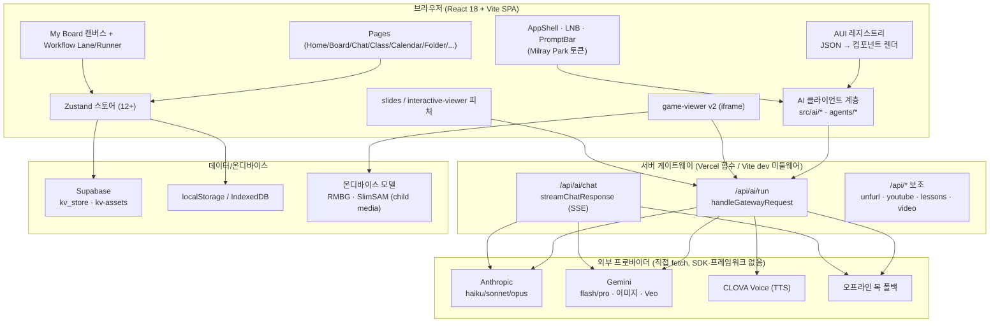
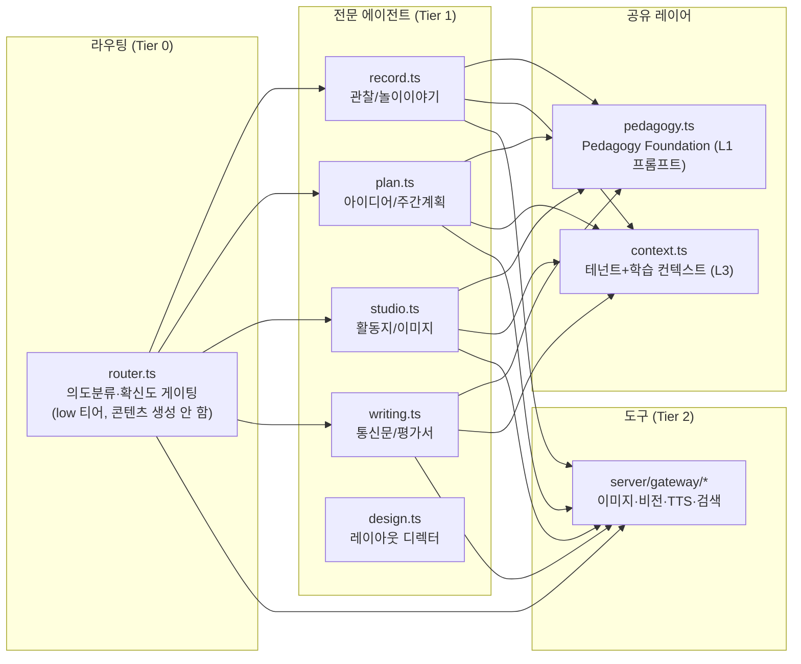
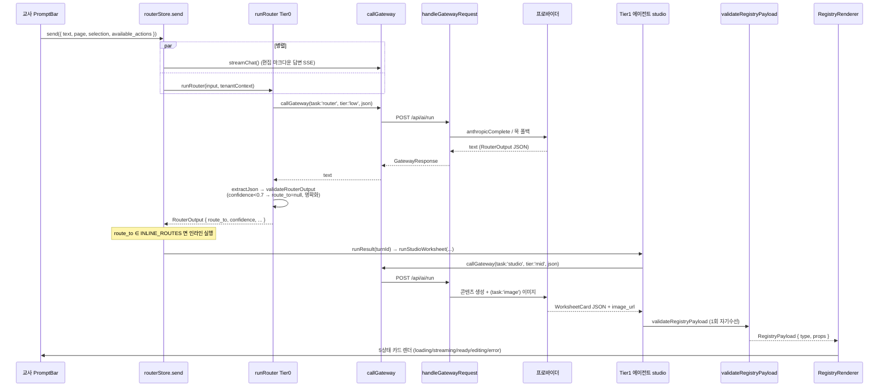
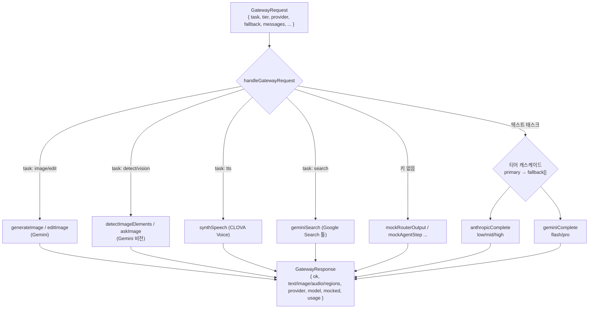
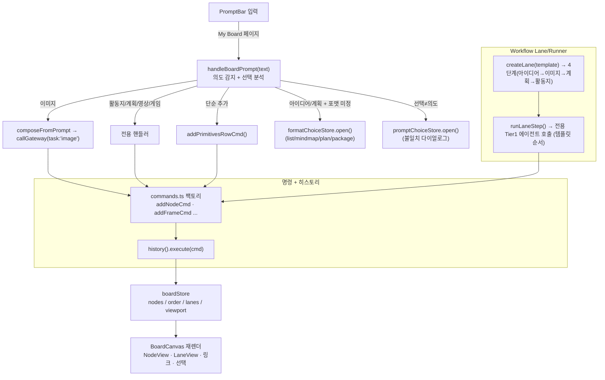
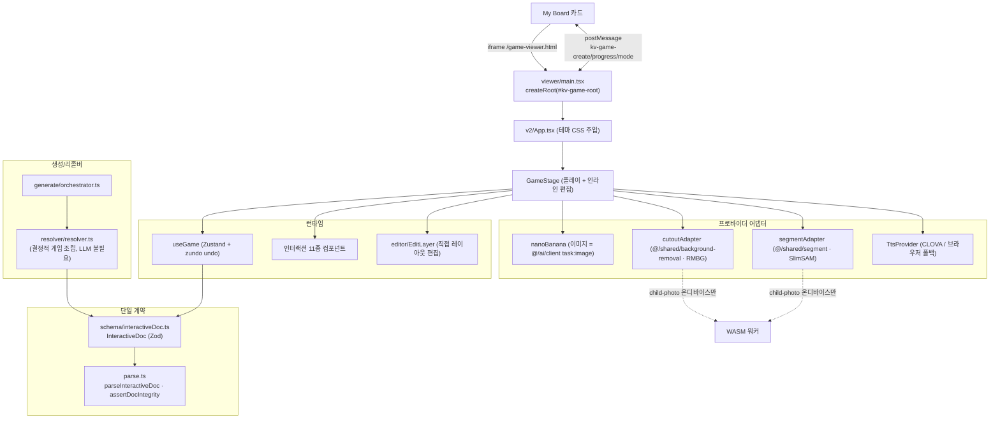
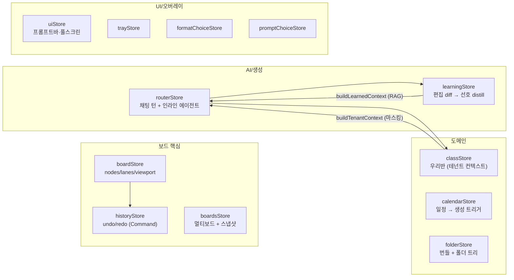
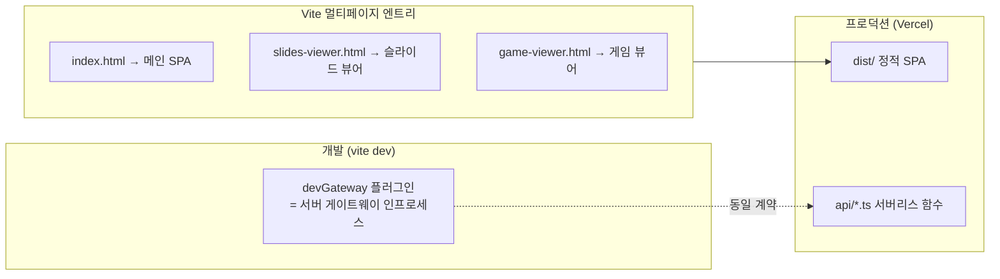

# KinderVerse 아키텍처 개요

> 코드에서 도출한 시스템 구조 문서. 제품 정의는 [`CLAUDE.md`](../CLAUDE.md), 기획은 [`PRD.md`](./PRD.md), 도메인/에이전트 지식은 [`.claude/skills/kinderverse/SKILL.md`](../.claude/skills/kinderverse/SKILL.md), 개발 시작은 [`ONBOARDING.md`](./ONBOARDING.md), 세부 모듈/API는 [`MODULE_REFERENCE.md`](./MODULE_REFERENCE.md)·[`API_REFERENCE.md`](./API_REFERENCE.md).

---

## 1. 한눈에 보는 시스템

KinderVerse는 **단일 SPA + 얇은 서버 게이트웨이** 구조다. 브라우저는 프로바이더 키를 절대 보지 않고, 모든 AI 호출은 동일 계약(`POST /api/ai/run`, `POST /api/ai/chat`)으로 서버를 거친다. 키가 없으면 게이트웨이가 **오프라인 목(mock)** 으로 폴백하므로 앱 전체가 키 없이도 동작한다.

**핵심 원칙 (CLAUDE.md 하드 룰에서 직접 도출)**
- **키는 서버에만.** 클라이언트는 `callGateway()`로만 모델에 접근(`src/ai/client.ts`).
- **AUI는 임의 HTML 금지.** 에이전트는 `{ type, props }` JSON만 출력 → 검증 → 레지스트리 컴포넌트 렌더.
- **무근거 생성 금지.** 관찰/평가는 `source`(근거) 없이는 검증 실패.
- **아동 미디어 격리.** `child-photo`/`child-video`는 외부 API 미전송, 온디바이스(WASM)에서만 처리.
- **프레임워크 금지.** LangChain/CrewAI 없이 직접 `fetch`.

---

## 2. 계층 구조

| 계층 | 책임 | 모델 티어 | 위치 |
|---|---|---|---|
| **Tier 0 라우터** | 의도분류·슬롯추출·라우팅·확신도. 콘텐츠 생성 안 함 | low (`claude-haiku-4-5`) | `src/ai/agents/router.ts` |
| **Tier 1 에이전트** | 기록·계획·스튜디오·문장. Pedagogy Foundation 상속 | mid→high fallback | `src/ai/agents/{record,plan,studio,writing,design}.ts` |
| **Tier 2 도구** | 이미지/비디오 생성, 비전, TTS, 검색 | 프로바이더별 | `server/gateway/*` |
| **공유 레이어** | 유아교육 적합성·테넌트·학습 선호 주입 | — | `src/ai/pedagogy.ts`, `src/ai/context.ts` |

**4계층 프롬프트 조립**: 모든 에이전트의 시스템 프롬프트는 `L0(헌장) + L1(PEDAGOGY_FOUNDATION) + L2(태스크 스키마) + L3(테넌트/학습 컨텍스트)`로 조립된다(`src/ai/prompt.ts`, `prompt-record.ts`).

---

## 3. AI 요청 데이터 흐름

프롬프트바 제출부터 검증된 AUI 렌더까지의 단대단 흐름이다.

**검증·자기수선·안티-환각**
- `extractJson()` (관용적 JSON 추출) → `validateRouterOutput()` / `validateRegistryPayload()` (의존성 없는 손수 검증).
- 스키마 위반 시 **에러 메시지를 붙여 1회 재호출**(자기수선). 그래도 실패하면 `ClarifyPrompt`로 폴백.
- **라우터 룰 4**: `confidence < 0.7` → 라우팅 대신 명확화 질문(`CONFIDENCE_THRESHOLD = 0.7`).
- **근거 강제**: `RecordDraftCard`의 모든 `observations[].source`는 비어 있을 수 없음(사진 ID/교사 메모 인용).
- **고위험 검증**: `AssessmentReport`는 생성 후 자동 적합성 체크 1회(`suitabilityCheck()`).

---

## 4. 프로바이더 게이트웨이

| 티어 | Anthropic | Gemini | 용도 |
|---|---|---|---|
| **low** | `claude-haiku-4-5` | `gemini-2.5-flash` | 라우터·Veo 프롬프트·디자인 |
| **mid** | `claude-sonnet-4-6` | `gemini-2.5-flash` | Tier1 에이전트(record/plan/studio/writing) |
| **high** | `claude-opus-4-8` | `gemini-2.5-pro` | 복잡 작업 fallback |

- 프로바이더 우선순위: `auto` → Anthropic(헌장 기본) → Gemini.
- 모든 모델 ID는 `.env`로 오버라이드 가능(`KV_ANTHROPIC_MODEL_*`, `KV_GEMINI_MODEL_*`).
- 게이트웨이 구현: `server/gateway/handler.ts`, 어댑터: `server/gateway/providers.ts`, 목: `server/gateway/mock.ts`.
- 개발 환경에서는 `vite-plugins/devGateway.ts`가 Vercel 함수와 **동일 계약**으로 엔드포인트를 마운트한다.

---

## 5. 보드 + Workflow Lane

My Board는 KinderVerse의 핵심 창작 표면이다. 보드 상태(raw ops)는 `boardStore`에, 되돌리기 단위(Command)는 `historyStore`에 분리된다.

- **Workflow Runner는 새 에이전트가 아니다.** 템플릿 순서대로 기존 Tier1 에이전트(plan, studio)를 호출하고, **진행은 교사 클릭으로만**, **선택이 다음 단계 입력**이 된다(`src/board/lanes.ts`).
- **프레임+러너 모델**(`src/board/workflow.ts`): "새 놀이계획" 프레임이 보드 네이티브 카드를 생성·자동 확장. 모든 카드는 선택·드래그·인라인 편집 가능.
- **자율성 게이트**: L1(초안·레이아웃)=자동, L2(통신문·공지)=확인, L3(외부 발송·영구 삭제)=휴먼게이트(되돌리기 스택에 안 들어감).

---

## 6. game-viewer (자기완결 모듈)

게임 뷰어는 보드에 **iframe(`/game-viewer.html`)** 으로 임베드되는 독립 React 런타임이다. 아이 대면 파스텔 테마(`v2/theme.ts`)를 쓰며 Milray Park 토큰을 적용하지 않는다(면제 대상).

- **단일 계약**: 생성·편집·런타임 모두 `InteractiveDoc` 하나에 의존. 런타임 코드 생성 없음.
- **인터랙션 11종**: tap-the-right-one, match-pair, binary-choice, connect, flip-memory, combine, categorize, order-sequence, find-it, sequence-tap, pattern-next. (문서 1개당 정확히 1종)
- **이펙트 3종**: reveal, responsive-state, goal-state. **확장 활동 6종**: discuss, story, name-create, connect-apply, move-express, watch-video.
- **아동 미디어 가드**: `assertNotChildMedia()`가 외부 전송을 차단. 배경 제거(RMBG)·분할(SlimSAM)은 WASM 워커에서 온디바이스 실행.

세부 임베드 계약(7개 불변점)·심화는 [`MODULE_REFERENCE.md` §5 game-viewer](./MODULE_REFERENCE.md#5-game-viewer-srcgame-viewerv2) 참조.

---

## 7. 상태 관리 (Zustand)

상태는 도메인별로 분리되어 있고, 보드 상태와 히스토리(되돌리기)는 의도적으로 별도 스토어다.

- **자가고도화 폐루프**: 생성 → 교사 편집/채택 → diff 신호 → `distill()` → exemplar/선호 → 다음 생성에 L3로 주입(`learningStore`).
- **테넌트 컨텍스트**: `classStore.buildTenantContext()`가 아동명 마스킹 후 라우터·에이전트의 L3 레이어에 자동 동봉.
- 영속: `learningStore`=localStorage, `folderStore`=IndexedDB(+클라우드 미러), 나머지=세션/로컬.

스토어별 상태·액션 전체는 [`MODULE_REFERENCE.md` §스토어](./MODULE_REFERENCE.md#1-스토어-srcstore) 참조.

---

## 8. 빌드/배포 토폴로지

- 멀티페이지 입력은 `vite.config.ts`의 `build.rollupOptions.input`(main/slides/game).
- `vercel.json`: `/((?!api/).*)` → `/index.html` SPA 폴백. 설치 시 `ONNXRUNTIME_NODE_INSTALL=skip`.
- 경로 별칭 `@/*` → `./src/*` (`tsconfig.app.json`).
- 디자인 토큰: Tailwind 값 전부 `src/styles/tokens.css`의 CSS 변수 참조(하드코딩 0).

상세 환경변수·엔드포인트·테이블은 [`API_REFERENCE.md`](./API_REFERENCE.md) 참조.
