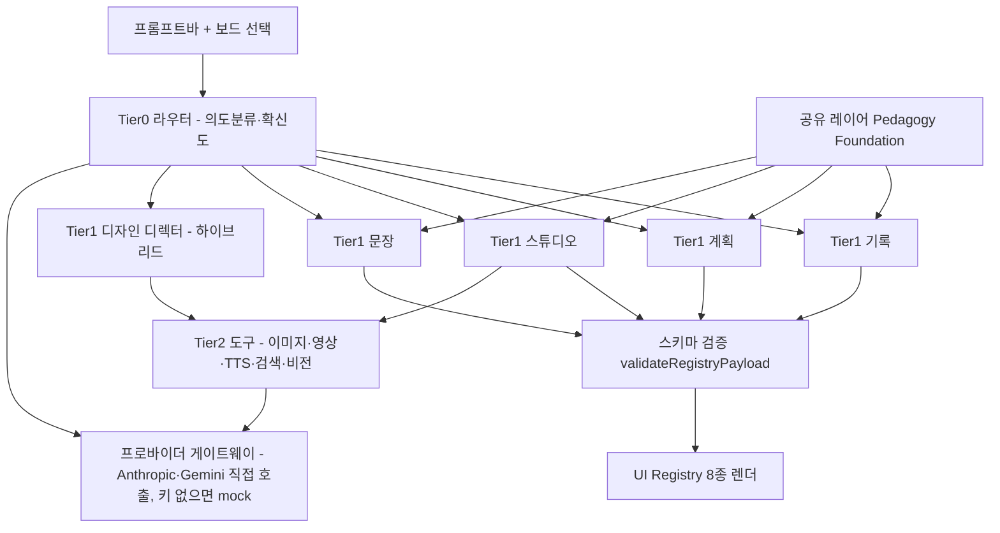
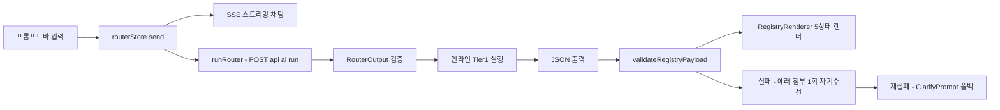

# KinderVerse (킨더버스) — Product Requirements Document

> "공간 단위" 유치원 교사 워크스페이스. 교사가 말하거나 고르면, 얇은 3계층 에이전트가 만들어 준다 — 확정은 언제나 교사가.

## 0. 문서 안내

| 항목 | 내용 |
|---|---|
| 문서 역할 | **상세 기획** (제품 컨셉·핵심 계약·기능 인벤토리) |
| 기준일 | **v3 — 2026-07-07** (인터랙티브 대개편·그림자 퀴즈·문서 편집 페이지 반영) |
| 범위·현황 단일 진실원 | `README.md` · `docs/ONBOARDING.md` — §4 표의 '상태' 열은 기준일 참고 스냅샷일 뿐, 현황 판단은 항상 README 기준 |
| 헌장·하드 룰 | `CLAUDE.md` |
| 도메인·에이전트 지식 | `.claude/skills/kinderverse/SKILL.md` |

**코드 기준 심화 문서 4종** — 스키마·export 목록·엔드포인트 파라미터는 이 문서에 복제하지 않고 아래를 참조한다(사본은 반드시 드리프트한다).

| 문서 | 내용 |
|---|---|
| `docs/ONBOARDING.md` | 5분 실행, 키 조합별 동작 표, 디렉터리 지도, 핵심 흐름 멘탈 모델 |
| `docs/ARCHITECTURE.md` | 시스템 전체도, 계층 구조, AI 요청 데이터 흐름(시퀀스), 스토어 지도, 클라우드 동기화, 빌드/배포 |
| `docs/MODULE_REFERENCE.md` | 모듈별 실제 export 심볼 표 + **확장 레시피 5종**(§9: 새 AUI/에이전트/보드명령/게임인터랙션/프로바이더 태스크) |
| `docs/API_REFERENCE.md` | HTTP 엔드포인트 7종 계약, AUI 카드 props 스키마 8종, 환경변수 목록, Supabase 데이터 모델 |

관련 스펙: `docs/kinderverse-game-engine-spec-v0.2.md` · `docs/kinderverse-lane-infrastructure-spec-v1.0.md`(둘 다 **B 시스템** 대상 — §4 경고 박스 참조). `m0-handoff/*`는 역사적 인계 문서(일부 superseded).

---

## 1. 제품 개요

**한 줄 정의**: 킨더버스 = "공간 단위" 교사 워크스페이스. 교사가 자연어로 말하거나 보드 위 대상을 선택해 명령하면, 얇은 3계층 에이전트가 의도를 해석해 전문 에이전트/도구로 라우팅하고, 결과를 레지스트리 제약 AUI로 렌더한다.

**문제 → 해결**

| 문제 | 해결 |
|---|---|
| 문서 단위 도구는 교사의 "끝내야 할 일" 흐름과 어긋남 | 공간(보드) + 자연어 + **선택(대상)** — 선택이 곧 명령의 범위 |
| AI가 관찰·평가를 지어냄 | 무근거 생성 금지 계약 — grounding 없으면 생성 거부, `validateRegistryPayload`가 계약 수준에서 집행 |
| 생성 결과가 매번 다르게 보임 | 레지스트리 제약 AUI — JSON→스키마 검증→고정 컴포넌트 렌더 |
| 쓸수록 나아지지 않음 | 자가고도화 폐루프 — 편집 diff→distill→exemplar/선호→다음 생성 L3 주입 |
| 과잉 자동화 불안 | 자율성 게이트 L1~L3 + 워크플로는 교사 클릭으로만 진행 |

**대상 사용자**: 만 0~5세 담임 교사. 영아반(0~2, 표준보육과정: 일상·기본생활습관 중심) / 유아반(3~5, 누리과정: 놀이중심). 행정 부담이 크고 모바일/태블릿 사용이 빈번하다.

**Job Stories**

| # | 시나리오 |
|---|---|
| 1 | 하원 후 사진 던지고 → "오늘 햇살반 블록놀이 관찰기록" → 연령 맞춤 초안 + 사진 자동 배치 |
| 2 | "다음 주 봄 주제 놀이계획" → 주안 카드 |
| 3 | "현장학습 가정통신문, 우리 원 톤" → 통신문 초안 |
| 4 | "봄꽃 색칠 도안 A4" → 스튜디오 이미지/도안 |
| 5 | (영아) "지호 이번 주 수유·낮잠 패턴 정리" → 영아 일상 기록 |
| 6 | 보드에서 카드 2~3개 선택 → "이거 묶어서 기록 한 장으로" → 병합 생성 |

**핵심 가치**
1. **선택이 곧 범위** — 보드에서 고른 대상이 다음 명령의 입력이 된다.
2. **근거 있는 생성** — 관찰/평가는 사진·교사메모 근거 없이는 만들지 않는다. 결과에 근거 출처 + 누리/표준 영역 연계를 표시.
3. **교사가 확정** — 자율성 게이트(L1~L3), 레인·패키지 진행은 교사 클릭으로만.
4. **키 없이도 완전 동작** — 게이트웨이가 결정적 mock으로 폴백, 데모·개발이 항상 가능.

**비전**: "교사가 말하거나 고르기만 하면, 우리 원의 맥락을 아는 동료가 만들어 준다 — 확정은 언제나 교사가."

**품질 목표(달성 추적)**: 4대 태스크(놀이기록/관찰기록·놀이계획·통신문/문장·스튜디오) 자연어 생성+편집. 라우팅 정확도 ≥90% — 인앱 `/eval` 하네스로 상시 검증(최근 검증 시 회귀 10/10 · 라우팅 100%). 수정 없이 채택률(목표 30%→55%+)은 ProfilePage 대시보드로 추적.

**비목표**: 킨더뷰 심층 통합 / 모델 파인튜닝(RAG·메모리로 대체) / 화이트·다크 모드(웜 단일 유지).

---

## 2. 한눈에 보는 전체 그림

### 2.1 화면 지도 (라우트)

Vite 멀티페이지 엔트리 3개(`vite.config.ts` `rollupOptions.input`) — `index.html`(메인 SPA, `src/routes.tsx`) · `game-viewer.html` · `slides-viewer.html`.

| 라우트 | 페이지 | 요약 |
|---|---|---|
| `/` | HomePage | **추천 자료 갤러리 홈** — 가로 스크롤 카드 10종 + 퀵 액션 알약 5개, 카드 클릭→프롬프트바 채움 |
| `/board` | MyBoardPage | My Board 통합 캔버스 — 멀티 보드, 프레임+네이티브 카드 하이브리드, 제자리 생성 |
| `/gallery` | GalleryPage | 자료 갤러리 — 선택→보드 트레이 담기, 카드/필터 통일 스타일, 정밀 검색 |
| `/folder` | FolderPage | 자료보관(폴더) — 레인/프레임 번들 저장, 삭제 L3 게이트 |
| `/doc/:nodeId/edit` | DocEditPage | **문서 편집 페이지** — 좌 구조편집 · 중 영역선택 · 하 프롬프트바 AI 수정 |
| `/chat` | AIChatPage | 스트리밍 마크다운 채팅 + 라우터 병렬(맥락 액션 카드) |
| `/class` | OurClassPage | 우리반 — 반·아동·투약·출결·하원·동의, 테넌트 컨텍스트 소스 |
| `/calendar` | CalendarPage | 일정 → 생성 트리거 |
| `/profile` | ProfilePage | 자가고도화 대시보드(채택률·편집량 추이) |
| `/eval` | EvalPage | 골든셋 회귀 + 라우팅 정확도 하네스(테스트 러너 대체) |
| `/tokens` | TokensDemoPage | 디자인 토큰 확인 |
| `game-viewer.html` | 게임뷰어 v2 (A) | 독립 iframe 뷰어, 엔트리 `viewer/main.tsx` |
| `slides-viewer.html` | 슬라이드 뷰어 | DeckSpec 재생 |

셸: `AppShell` + LNB(`src/lib/nav.ts`) + **공용 PromptBar**(전 페이지 상주, 페이지별 `availableActions` 화이트리스트 `actionsForPath`).

### 2.2 시스템 계층

### 2.3 AI 요청 한 사이클

상세 시퀀스·자기수선·안티환각 규칙은 `docs/ARCHITECTURE.md` §3. My Board에서는 같은 입력이 `handleBoardPrompt`(§3.1)로 분기한다.

### 2.4 상태 관리 (Zustand 스토어 12종)

| 스토어 | 담당 |
|---|---|
| boardStore | 노드·레인·뷰포트·선택 (raw ops) |
| historyStore | Command 패턴 undo/redo (limit 100) — 보드 상태와 의도적 분리 |
| boardsStore | 멀티 보드·시드 보드·탭 전환 |
| routerStore | 채팅 스트림 + 라우터 병렬 실행 |
| classStore | 반·아동·투약·출결·동의, `buildTenantContext()` |
| calendarStore | 일정 |
| folderStore | 자료보관 번들 |
| learningStore | 편집 diff·선호·exemplar·distill (자가고도화) |
| uiStore | promptDraft·docEditNodeId 등 셸 상태 |
| trayStore | 갤러리→보드 트레이 |
| formatChoiceStore | 포맷 선택 오버레이 |
| promptChoiceStore | 프롬프트 선택지 |

export 상세는 `docs/MODULE_REFERENCE.md` §1. 참고: zundo(temporal)는 게임뷰어 v2 에디터 전용이며, 보드 undo/redo는 손수 작성한 historyStore다.

### 2.5 기술 스택 · 명령 (고정)

| 영역 | 선택 |
|---|---|
| Frontend | React 18 + Vite + TypeScript + Tailwind(시맨틱 토큰만) + Zustand + React Router |
| Backend | Vercel 서버리스 함수 + 개발용 `vite-plugins/devGateway.ts`(동일 계약 인프로세스) |
| DB(선택) | Supabase — Postgres + Storage(헌장상 pgvector). 미설정 시 로컬 전용 no-op |
| AI | 얇은 프로바이더 게이트웨이(Anthropic + Gemini 직접 fetch). **LangChain/CrewAI 등 프레임워크 금지** |
| 배치 | GitHub Actions(distill/인덱싱 등 비실시간만 — 이전 예정) |

| 명령 | 용도 |
|---|---|
| `npm install` | 신규 체크아웃 시 필수 선행(`node_modules` 미커밋) |
| `npm run dev` | Vite 개발 서버(localhost:5173) — devGateway가 `/api/*` 인프로세스 제공 |
| `npm run build` | `tsc -b && vite build` — **타입체크 포함, 작업 완료 전 필수 게이트** |
| `npm run lint` | eslint |
| `npm run preview` | 프로덕션 빌드 미리보기 |

경로 별칭 `@/*` → `./src/*`. **테스트 러너 없음** — 회귀·라우팅 검증은 인앱 `/eval`, 토큰 확인은 `/tokens`.

### 2.6 핵심 흐름 멘탈 모델 (5단계)

1. 입력은 항상 **공용 프롬프트바**(uiStore.promptDraft)에서 시작한다.
2. AI 채팅에서는 `routerStore.send()`가 스트리밍 채팅과 라우터를 **병렬** 실행한다.
3. My Board에서는 `handleBoardPrompt()`가 분기한다 — 직접 생성 / 포맷 선택 / 불일치 다이얼로그 / 단순 추가.
4. 보드 변경은 반드시 `commands.ts` → `history().execute()` → boardStore raw ops 경로를 탄다(undo 보장).
5. AI 출력은 항상 `{type, props}` JSON → `validateRegistryPayload` → RegistryRenderer 5상태 카드다.

---

## 3. 핵심 컨셉 4가지

### 3.1 공간 단위 보드 워크스페이스

- **멀티 보드**(boardsStore + `src/board/seed.ts`): 즐겨찾기 카드 클릭 = 목적별 최적화 시드된 새 보드 생성, 상단 탭 전환.
- **하이브리드 모델**: 프레임(frame) + 네이티브 카드 + 러너(runner) 노드 — 각 단계가 프레임 안에 카드를 생성(`src/board/workflow.ts`). 프레임 그룹 이동 + 자동 확장(`containedNodeIds`, placeInFrame→expandFrame).
- **제자리 생성**: 보드에서 대상 선택 + 프롬프트바 입력 → `handleBoardPrompt`(`src/board/prompt.ts`)가 의도 감지 후 분기 — 이미지 재생성(regenImageCard) / 텍스트 생성(genTextCard) / 프레임 내 생성(generateIntoFrame) / 포맷 선택 오버레이 / 불일치 다이얼로그 / 단순 추가. AI 채팅 이동은 메시지 아이콘 경유만.
- **되돌리기**: 모든 보드 변경은 Command 단위(`src/board/commands.ts` — add/move/delete/duplicate/group/lock/edit) → `history().execute()` → boardStore raw ops.
- **단축키**: Ctrl+Z / Ctrl+Shift+Z·Ctrl+Y / Delete / 전체선택 / 복제 / 그룹 / 잠금 / 줌 / Fit / Esc / Space+드래그 팬 — 입력 포커스 중에는 가로채지 않음.
- **프롬프트바 4동작**(하드 룰: 신규 제작 금지, `src/components/PromptBar.tsx` 재사용): 채팅 이동 · 별↔전송 토글 · 즐겨찾기 카드 레일 · 접기.

### 3.2 얇은 3계층 에이전트

| 계층 | 구성 | 역할 |
|---|---|---|
| Tier 0 | 라우터(`src/ai/agents/router.ts`, low 티어) | 의도분류·슬롯추출·선택 컨텍스트·라우팅·확신도. 콘텐츠 생성 안 함. `confidence < 0.7`(CONFIDENCE_THRESHOLD)이면 라우팅 대신 명확화 |
| Tier 1 | 기록 · 계획 · 스튜디오 · 문장 (+ **디자인 디렉터** — 하이브리드, Pedagogy 미상속·콘텐츠 미생성·DesignSpec만 산출) | 전문 생성. 4에이전트는 전원 Pedagogy Foundation 상속 |
| Tier 2 | 도구(`server/gateway/*`) | 이미지·영상 생성, TTS, 검색, 비전, 문서 템플릿, 분류·기억 |

- **4계층 프롬프트 조립**(`src/ai/prompt.ts`): L0 헌장 + L1 PEDAGOGY_FOUNDATION + L2 태스크 스키마 + L3 테넌트/학습 컨텍스트 — 모든 에이전트 시스템 프롬프트의 공통 구조.
- `/api/ai/run`의 task는 14종: router · record · plan · studio · writing · design · suitability · lane_step · slides · image · detect · vision · tts · search.
- 직렬 검수 없음 — 유아교육 적합성은 공유 레이어가 보장. 고위험 산출물(평가서)만 자동 적합성 검증 1회(`suitabilityCheck`: 발달적합성·무근거·영역연계·비낙인 체크리스트 → 통과/주의 배지).
- 기록 2모드: `observation`(관찰기록·평가용) / `story`(놀이기록=놀이이야기, 사진배치+활동서술, 학부모 발송용).
- 활동지는 항상 스튜디오가 생성 — (A)놀이계획 연결(계획이 맥락 공급) / (B)독립, 결과는 `link.plan_id`로 연결.
- 에이전트 명칭 = 기능명. 페르소나 이름 금지.

### 3.3 레지스트리 제약 AUI

에이전트는 **JSON만** 출력(`{type, props}`) → `validateRegistryPayload` 검증(실패 시 에러 첨부 1회 자기수선, 재실패 시 ClarifyPrompt 폴백) → UI Registry 컴포넌트 렌더(5상태: loading/streaming/ready/editing/error). **임의 HTML 생성 금지.**

| type (= 컴포넌트명 그대로) | 게이트 | 비고 |
|---|---|---|
| RecordDraftCard | L1 | `observations[].source` 비공백 강제(안티환각) |
| PlayStoryCard | L2 발송 | 놀이이야기, 사진 배치 |
| ClarifyPrompt | — | 명확화·검증 실패 폴백 |
| WeeklyPlanGrid | L1 | id를 활동지가 `link_plan_id`로 역참조 |
| WorksheetCard | L1 | 항상 스튜디오 생성 |
| StudioGallery | L1 | 이미지/도안 |
| LetterPreview | L2 | 통신문, 톤 토글 |
| AssessmentReport | L3 | 고위험, suitability 자동검증 배지 내장 |

게이트 표기: L1=자동(되돌리기 가능) · L2=확인 후 실행 · L3=휴먼게이트 — 정의는 §5.5.

카드별 props 전체 스키마는 `docs/API_REFERENCE.md` §2. 새 유형 추가 절차는 `docs/MODULE_REFERENCE.md` §9 — DoD: 레지스트리 등록 + 에이전트 출력 스키마와 1:1. 보드 프리미티브(StickyNote 등)·셸 컴포넌트는 레지스트리와 별개 계층이다.

**출력 계약 6규칙** (프롬프트바가 page+selection을 라우터에 동봉):
1. 선택 = 범위.
2. `available_actions` 밖 라우팅 금지.
3. 레이아웃 변경=L1 자동, 콘텐츠 생성=미리보기.
4. `confidence < 0.7`이면 되묻기.
5. grounding 없으면 관찰 생성 금지.
6. `suggested_next`는 선택지일 뿐 — 자동 실행 금지.

### 3.4 워크플로 레인 & 놀이 패키지

- **Workflow Lane**(`src/board/lanes.ts` · LaneView): 가로로 자라는 레인, 단계 노드(아이디어→이미지→계획안→활동지) 왼→오. **교사 클릭으로만 진행**(자동 전체 실행 금지), 선택이 다음 단계 입력, 모든 노드는 인라인+프롬프트바 편집, 레인 저장 = 폴더 번들. Runner는 새 에이전트가 아니라 기존 Tier1을 템플릿 순서로 호출. 라우터의 `suggested_next`(상황 제안)는 계획 항목 — 탑재 시에도 옅게 "추천"만, 자동 실행 금지.
- **포맷 선택 오버레이**(`src/components/FormatChoiceOverlay.tsx` + formatChoiceStore): 아이디어/놀이계획/수업/활동/프로젝트 수업 요청 시 형식 선택 모달을 경유하는 것이 기본 흐름. 아이디어 리스트는 선택형 행 + 프레임 하단 추천 + 복수 선택 지원.
- **놀이/프로젝트 패키지**: 7요소 한 세트 생성 — 스켈레톤 먼저 배치 후 병렬 채움, 게임은 인터랙티브 노드(B)로 생성, 활동별 동영상/이미지 링크 연결(유튜브 뷰어 포함), 보드 오른쪽 빈곳에 프레임 중앙 배치.
- LANE_TEMPLATES(레인)와 FRAME_TEMPLATES(프레임 작곡기 `composer.ts`, ComposerIntent 6종)는 **별개 시스템** — 혼용 서술 금지.

---

## 4. 기능 인벤토리

> ⚠️ **두 인터랙티브 시스템 혼동 주의 (필독)**
>
> | | **A — 게임뷰어 v2** | **B — 보드 네이티브 인터랙티브 노드** |
> |---|---|---|
> | 코드 | `src/game-viewer/v2/` | `src/features/interactive-viewer/` |
> | 계약 | `InteractiveDoc` (Zod, `parseInteractiveDoc`) | `InteractiveNode` |
> | 런타임 | 독립 iframe `/game-viewer.html` | 보드 카드 `type:'interactive'` |
> | 메커니즘 | 인터랙션 11종 + 효과 3종 | 메커니즘 12종 (명칭 체계가 A와 전혀 다름) |
>
> 이름만 비슷한 **별개 시스템**이다. `docs/kinderverse-game-engine-spec-v0.2.md` · `docs/kinderverse-lane-infrastructure-spec-v1.0.md`는 **B**를 다루며, 그 안의 "게임뷰어 v2(A) 폐기" 서술은 B 라인 설계 관점일 뿐 — **A 모듈은 현재도 활성**이다. 보드에서의 게임 생성은 B로 전환됐고 툴바 게임뷰어 프리셋은 제거됐다(A 모듈 자체는 유지).

### 4.1 보드·셸

| 기능 | 상태 | 코드 경로 | 요약 |
|---|---|---|---|
| My Board 캔버스 | ✅ | `src/components/board/BoardCanvas.tsx` 등 | 팬·줌·드래그박스·그리드, 작은 화면 태스크 리스트 폴백 |
| 노드 인라인 편집 | ✅ | `src/components/board/NodeView.tsx` | 메모·텍스트·도형·이미지 인라인 편집 |
| 보드 툴바·컨트롤 | ✅ | BoardToolbar, BoardControls | 생성 툴바·줌/Fit 등 가장자리 컨트롤 |
| 보드 명령/히스토리 | ✅ | `src/board/commands.ts`, historyStore | Command 단위 undo/redo, limit 100 |
| 멀티 보드 | ✅ | boardsStore, `src/board/seed.ts`, BoardSwitcher | 즐겨찾기 카드→시드 보드, 상단 탭 전환 |
| 프레임·러너 | ✅ | `src/board/workflow.ts`, `frames.ts` | 하이브리드 모델, 프레임 그룹 이동+자동 확장 |
| 프레임 작곡기 | ✅ | `src/board/composer.ts` | ComposerIntent 6종 — 레인과 별개 축 |
| 워크플로 레인 | ✅ | `src/board/lanes.ts`, LaneView | §3.4 |
| 제자리 생성 | ✅ | `src/board/prompt.ts` | `handleBoardPrompt` 분기 |
| 공용 프롬프트바 | ✅ | `src/components/PromptBar.tsx` | **신규 제작 금지 — 재사용이 하드 룰.** 메인 컬럼 중앙 정렬(promptBarLeftInset), 즐겨찾기 카드 레일, 페이지별 액션 화이트리스트 |
| 미니맵 네비게이터 | ✅ | `src/components/board/BoardMinimap.tsx` | MAP 버튼 → 전체 보기·드래그 이동, 프레임 밖 자료 강조 |
| 트레이 | ✅ | trayStore, `src/components/board/BoardTray.tsx` | 갤러리 선택→보드 트레이 담기 → 드래그/클릭 배치 |
| 링크 시각화 | ✅ | `src/components/board/BoardCanvas.tsx` | 부모→자식 빛 펄스(호버), 마인드맵 연결=요소 링크 통일, 포트 클램프 |
| 수업 모드·슬라이드쇼 | ✅ | `BoardControls.tsx` · NodeView | 프레임 단위 재생 |
| 포맷 선택 오버레이 | ✅ | `src/components/FormatChoiceOverlay.tsx` | §3.4 |

### 4.2 Tier1 에이전트

| 에이전트 | 코드 | 출력(AUI) | 비고 |
|---|---|---|---|
| 기록 | `src/ai/agents/record.ts` | RecordDraftCard / PlayStoryCard | 2모드(observation/story), 무근거 진술은 검증 실패→ClarifyPrompt |
| 계획 | `src/ai/agents/plan.ts` | WeeklyPlanGrid | 활동지가 `link_plan_id`로 역참조 |
| 스튜디오 | `src/ai/agents/studio.ts` | WorksheetCard / StudioGallery | 이미지 생성 플러그인(`server/gateway/image.ts`) 연동 — 키 미구성 시 'AI 생성' 라벨 플레이스홀더 |
| 문장 | `src/ai/agents/writing.ts` | LetterPreview / AssessmentReport | 통신문·공지·문장·평가서 모드 추론, 평가서만 suitabilityCheck 1회 |
| 디자인 디렉터 | `src/ai/agents/design.ts` | DesignSpec | 하이브리드 — Pedagogy 미상속, 콘텐츠 미생성 |

### 4.3 인터랙티브 게임 시스템 (B — 보드 네이티브, 현행 주력)

| 요소 | 상태 | 코드 경로 | 요약 |
|---|---|---|---|
| 계약·런타임 | ✅ | `src/features/interactive-viewer/` | InteractiveNode, 동작엔진(액션·트리거·조건/체인), 노드 내부 다중 레인 |
| 리졸버 3단 폴백 | ✅ | `resolver/designAgent.ts` → `resolver/resolveIntent.ts` → `authoring/composeNode.ts` | designGame(AI 설계) → resolveIntent(규칙) → composeInteractiveNode(롱테일) |
| 메커니즘 12종 | ✅ | `resolver/index.ts` | sequence-order · path-trace · pair-match · tap-select · branch-choose · combine · sort-to-bin · slot-fill · free-create · memory-flip · dress-up · **shadow-quiz** (rhythm-tap만 보류) |
| 레시피 | ✅ | `resolver/recipes/{quiz,dressUp,dragSort,combos,freeCreate,native}.ts` | 테마팩×메커니즘 조합 |
| 게임 디자인 에이전트 | ✅ | `resolver/designAgent.ts`(designGame) · `authoring/artDirect.ts` | Tier1 설계 두뇌 — 메커니즘 선택·풍부한 내용·교사 활동 카드 |
| 생성 사슬 단일화 | ✅ | `authoring/createChain.ts` | `runFullCreation` — 노드/풀스크린/패키지 경로 통합, designGame 필수 경유(교사카드·라이브러리 저장 포함). dress-up·shadow-quiz는 결정론이라 에이전트 스킵 |
| designGame 견고화 | ✅ | `resolver/designAgent.ts` | maxTokens 1600→4000, 캐시 v2+TTL, 실패 4갈래 관측화, 부분 반환 |
| 거짓 성공 제거·격리 | ✅ | createChain·composeNode·store | 최소 내용 게이트 · no-op 게이트 · 실패 시 빈 노드 정리 · 파싱 실패 **quarantine**(빈 노드 영구 덮어쓰기 차단) · sanitizeDoc |
| 이미지·입력 견고화 | ✅ | artDirect·InteractiveStage | 이미지 지수 백오프+동시성 3 풀 · 연타 조기승리 방지 · 400ms 쿨다운 · speak 논블로킹(엔진 스키마 무변경) |
| 대사 계약(P1) | ✅ | 전 레시피 | introText/winText/wrongText/items[].speak — 도입 안내·오답 교정·정답 칭찬·완료 축하·진행도 결정론 배선(룰 폴백 보장) |
| 오답 변별 | ✅ | tap-select·branch-choose | 전원-정답 퇴화 수정(정답 60%+타 테마팩 오답), 임의 정답 차단 |
| 그림자 퀴즈 | ✅ | `resolver/recipes/quiz.ts` | 한 문제씩(그림자 1개+선택지 3개)×5문제 자동 진행 · 그림자=정답 실루엣(같은 원본 파생 → 픽셀 일치) · 정답 시 그림자→실제 색깔 객체 리빌+팝 · 라우팅: '그림자'→shadow-quiz, '선/줄로 연결'→pair-match |
| dress-up(옷입히기) | ✅ | dressUp 레시피 | 레이어드 꾸미기(base 고정+부위별 팔레트), 드래그 착장, 정면·얼굴·성별 일관, 통합 날씨 전환+창밖 썸네일, 같은 아이 캐릭터 시트 재사용, 옷 색매칭 |
| 확장 내부화 | ⏸ **의도적 보류** | `extendLane.ts`, `resolver/extend.ts` | **데드코드 아님 — 삭제 금지.** 부활=UI 글루 ~25줄(레인 스펙 §9). 재생 완료 바의 '확장 활동' 버튼은 사용자 요청으로 제거됨 |
| 클라우드 동기화 | ✅ | 라이브러리 동기화 | pagehide 플러시 + `updated_at` 신선도 가드(+역푸시)로 리로드 롤백 해소 |
| 교사 카드 | ✅ | 전 게임 보장 | 모든 게임에 교사 활동 카드 + 발문 |

### 4.4 게임뷰어 v2 (A — 별개 시스템, 활성)

| 요소 | 코드 경로 | 요약 |
|---|---|---|
| 계약 | `src/game-viewer/v2/schema/interactiveDoc.ts` | InteractiveDoc 단일 계약(**런타임 코드 생성 금지**) — 생성·편집·런타임 전부 이 문서만 의존 |
| 인터랙션 11종 | v2 런타임 | tap-the-right-one · match-pair · binary-choice · connect · flip-memory · combine · categorize · order-sequence · find-it · sequence-tap · pattern-next |
| 효과 3종 | v2 런타임 | reveal · responsive-state · goal-state (**reveal은 인터랙션이 아니라 효과**) |
| 확장활동 | v2 런타임 | 6종 |
| 편집·리졸버 | EditLayer, `resolver/` | 고급 편집 + 결정적 리졸버(LLM 없이 프롬프트→추천카드 조립 가능) |
| 엔트리·임베드 | `game-viewer.html` → `viewer/main.tsx` | postMessage 계약, **엔트리·임베드 계약 불변 7곳**(`docs/MODULE_REFERENCE.md` §5) |

옛 v1 GameSpec 게임뷰어는 **제거됨**(v2가 대체, git 이력 보존). `m0-handoff/*`는 역사적 인계 문서로만 인용.

### 4.5 콘텐츠 생성·문서

| 기능 | 상태 | 코드 경로 | 요약 |
|---|---|---|---|
| 슬라이드 엔진 | ✅ | `src/features/slides/`, `slides-viewer.html` | DeckSpec(JSON only) 2티어 생성, 레이아웃 11종·테마 7종(`--s-*`, Milray 면제는 콘텐츠 한정), Recharts 차트, PDF/PPTX 브라우저 내 내보내기, B 노드용 interactive 레이아웃(Slide.nodeId/advance, 완료 시 자동 넘김) |
| 영상 생성(Veo) | ✅ | `server/gateway/video.ts` | `/api/ai/video/{start,poll}` 비동기 2단계, Veo 3.0 fast(4초·16:9·720p), 과금 확인 게이트·in-flight 중복 가드, 서버가 mp4 변환·키 비노출 |
| 활동지 시스템 | ✅ | `src/ai/worksheet-reference.ts` (단일 소스) | **18종 유형 카탈로그** · 카테고리 6영역(수·셈 / 짝짓기·분류 / 변별·관찰 / 소근육·오리기 / 미술·표현 / 언어·낱말) · 스타일 4종 · 연령대별 후보 규칙 · 자연어 별칭 · A4 인쇄 파이프라인(1240×1754px). 수 세기 유형은 답 네모 비움·같은 그림만 등 엄격화 |
| 문서 편집 페이지 | ✅ 최신 | `src/pages/DocEditPage.tsx`, `src/features/doc-edit/`, `src/board/docEdit.ts` | 아래 상세 |
| 유튜브·링크 | ✅ | `/api/youtube/search`, `/api/unfurl` | 키리스 검색(ytInitialData 파싱), 링크 미리보기, 웹링크 카드 풀블리드 썸네일, 유튜브 재생 뷰어 |

**문서 편집 페이지 계약** (`/doc/:nodeId/edit`, 진입 = 보드 '문서' 카드 우상단 연필):

| 요소 | 내용 |
|---|---|
| 레이아웃 | 3분할 — 좌: 놀이계획이면 PlanFieldsEditor(WeeklyPlanGrid payload 구조 편집), 그 외 SectionTextEditor(섹션 텍스트) / 중: DocSections(렌더된 문서, 섹션 클릭 다중 선택) / 하: 공용 프롬프트바(AppShell 도킹)로 선택 영역만 AI 수정 |
| 단일 진실원 | **payload**(WeeklyPlanGrid props) — payload 유무로 구조 편집 vs 영역 편집 폴백을 가른다. 프로젝트 계획은 제목의 '프로젝트' 포함으로 구분 |
| 배관 | 페이지가 떠 있는 동안 프롬프트바 입력이 보드로 새지 않고 이 문서로 라우팅(uiStore 플래그 + 이벤트 경유 — 직접 import 없음, 순환 방지) |
| AI 수정 | 선택 섹션(heading 경계 분할)만 문장 에이전트로 되쓰고 무손실 재조립 — 선택 없으면 문서 전체, 변경 없으면 no-op 거부 |
| 커밋 | `editTextCmd` — 되돌리기 가능. 구현 상세는 `src/board/docEdit.ts` 헤더 주석 참조 |

### 4.6 자료·데이터 페이지

| 기능 | 상태 | 코드 경로 | 요약 |
|---|---|---|---|
| 자료보관(폴더) | ✅ | folderStore, FolderPage | 프레임 저장 버튼 **"자료보관"**(내용 변경 시 재저장), 레인 저장=매니페스트 번들 1건, 활동지↔계획 연결 표시, 동영상/뷰어는 재생 뷰어로, 삭제 L3 |
| 자료 갤러리 | ✅ | GalleryPage | 선택→보드 트레이, 인터랙티브 썸네일 정적 캡처, 카드/필터 스타일 통일. 검색 정밀화: 게임 키워드=게임만, 종류 키워드 추천('이미지'→모든 이미지 등), 카테고리·1글자 검색·조사 오제거 수정 |
| 우리반 | ✅ | classStore, OurClassPage | `buildTenantContext()` + `maskName()`(성+O 마스킹) — 1차 컨텍스트를 L3 레이어로 전 생성에 자동 동봉 |
| 캘린더 | ✅ | calendarStore, CalendarPage | 일정→생성 트리거 |
| AI 채팅 | ✅ | `src/ai/chat.ts`, MarkdownMessage, `server/gateway/chat.ts` | SSE 스트리밍 마크다운(Anthropic=실시간 패스스루 / Gemini=완성 후 타자기 / 키 없음=데모) + 라우터 병렬 — 프로즈 아래 맥락 액션(확신도≥0.7→생성 카드→AUI, 모호→옵션 칩) |
| 자가고도화 | ✅ | learningStore, `src/ai/context.ts` | 생성→교사 편집 diff→distill→exemplar/선호→`buildAgentContext()`가 모든 Tier1 생성에 L3 주입(폐루프), ProfilePage 대시보드 |
| /eval 하네스 | ✅ | `src/eval/{golden,run}.ts`, EvalPage | 출력 계약 회귀(결정적, 안티환각 회귀 포함) + 라우팅 정확도(라이브, KPI ≥90%) — **테스트 러너 없음, 이것이 유일한 검증 수단** |

---

## 5. AI·데이터 계약

### 5.1 프로바이더 게이트웨이

- 얇은 게이트웨이 — Anthropic + Gemini **직접 fetch**(LangChain/CrewAI 등 프레임워크 금지). 브라우저는 프로바이더 키를 절대 보지 않고 `callGateway()`(`src/ai/client.ts`)로만 모델 접근.
- 개발: `vite-plugins/devGateway.ts`가 `/api/*`를 인프로세스 제공(Vercel 함수와 동일 계약). 배포: Vercel 서버리스(`vercel.json` SPA 폴백).
- **키 없이 완전 동작** — 오프라인 결정적 mock 폴백. 키 조합: 없음=전체 목 / Anthropic만=텍스트 실연동 / Gemini만=이미지·영상 포함 실연동 / 둘 다=auto(Anthropic 우선, Gemini 폴백).
- 모델 티어 캐스케이드: low=haiku-4-5/gemini-2.5-flash(라우터·디자인) · mid=sonnet-4-6(Tier1) · high=opus-4-8/gemini-2.5-pro(폴백). 전 모델 ID `.env` 오버라이드 가능(`KV_*_MODEL_*`). 키는 서버 전용 — `VITE_` 접두사만 브라우저 노출.

| 엔드포인트 | 요약 |
|---|---|
| `POST /api/ai/run` | 마스터 게이트웨이 — GatewayRequest, task 14종(§3.2) |
| `POST /api/ai/chat` | SSE 스트리밍(Anthropic 델타 형식으로 통일) |
| `POST /api/ai/video/start` · `GET /api/ai/video/poll` | Veo 비동기 2단계(기본 veo-3.0-fast-generate-001) |
| `GET /api/youtube/search` | 키리스 ytInitialData 파싱 |
| `GET /api/unfurl` | 링크 미리보기 |
| `/api/lessons` | 스텁(진실 소스는 클라이언트) |

요청/응답 전체 계약·환경변수 목록은 `docs/API_REFERENCE.md` §1/§3.

### 5.2 게임 소재 프로바이더 체인 (교체 가능)

| 단계 | 프로바이더 | 코드 | 비고 |
|---|---|---|---|
| 이미지 생성 | 나노바나나 | `@/ai/client` `task:'image'` | 게이트웨이 경유 |
| 누끼(배경제거) | briaai/RMBG-1.4 (q8 WASM) | `@/shared/background-removal` | **BRIA 비상업 라이선스 — 상업화 전 BiRefNet(MIT) 교체 필수(현재 미사용).** `@imgly`(AGPL) 금지 |
| 객체분할 | SlimSAM | `@/shared/segment` | 온디바이스 |
| 인페인팅 | PatchMatch | `@/shared/*` | 온디바이스 |
| 음성 | CLOVA Voice | `task:'tts'` | 키 없으면 브라우저 TTS 폴백 |

현재 `SERVER_ENABLED=false` — 배경제거·분할·인페인팅 전량 온디바이스 WASM 워커. child-photo/child-video는 어떤 단계에서도 외부 API로 전송하지 않는다(`assertNotChildMedia`).

### 5.3 아동 데이터 5원칙 + 거버넌스

1. 테넌트(원) 단위 격리 — *요구사항이며 현황 아님*(현재 데모 anon 모델, §8 참조).
2. 공용 모델 학습 사용 금지.
3. `consent_flag` 없는 사진은 파이프라인 제외.
4. 삭제는 L3 휴먼게이트.
5. **child-photo/child-video는 외부 API 미전송**(`assertNotChildMedia`) — 아동 미디어 처리 전량 온디바이스.

거버넌스 정책 10종(테넌트격리·동의·마스킹·무근거금지·고위험검증·발송게이트·삭제L3·공용학습금지·보존·법무)과 시행 지점은 `src/lib/governance.ts` 레지스트리로 관리.

### 5.4 하드 룰 6개 (CLAUDE.md §2 요약 — 위반 금지)

| # | 룰 |
|---|---|
| 1 | 디자인 토큰은 Milray Park 시스템만(§6). 브랜드 보이스/카피는 금지 — 시각 토큰만 |
| 2 | 프롬프트바는 새로 만들지 말 것 — `src/components/PromptBar.tsx` 공용 셸 컴포넌트 재사용 |
| 3 | AUI는 임의 HTML 생성 금지 — JSON→스키마 검증→레지스트리 렌더만 |
| 4 | 무근거 생성 금지 — 관찰/평가는 grounding 필수, 근거 출처+누리/표준 영역 연계 표시 |
| 5 | 아동 데이터 — 테넌트 격리·공용 학습 금지·`consent_flag` 미동의 제외·삭제 L3 |
| 6 | 에이전트 명칭 = 기능명(페르소나 이름 금지) |

### 5.5 자율성 게이트

| 레벨 | 원칙 | 예 |
|---|---|---|
| L1 자동 | 되돌리기 가능 | 초안 생성, 사진 분류, 보드 레이아웃 변경 |
| L2 확인 | "이대로 진행?" 확인 후 실행 | 가정통신문·공지 생성, 놀이이야기 발송 |
| L3 휴먼게이트 | 사용자가 직접 실행 | 외부 발송, 영구 삭제, 권한 변경, 평가서 |

### 5.6 영속화·동기화

| 계층 | 저장소 | 내용 |
|---|---|---|
| 로컬 1차 | localStorage | 보드 메타·수업기록·학습신호 |
| 로컬 1차 | IndexedDB | 보드 스냅샷(kv-board)·폴더(kv:folder:v1)·보관함(image-assets:v1)·영상(video-asset:v1:*)·갤러리 썸네일(gallery-thumbs:v1)·슬라이드 이미지(slide-image:v1:*) |
| 로컬 1차 | 파일DB | `.kv-data` |
| 클라우드 미러 | Supabase `kv_store` | last-write-wins(키 스킴 ls:/idb:), base64 에셋은 `externalizeAssets()`가 `kv-assets` 버킷으로 외부화(콘텐츠 해시 dedup). **미설정 시 전부 no-op(로컬 전용)** |

부팅 순서(main.tsx): `installLocalStorageMirror()` → `initCloudSync()`. B 인터랙티브 라이브러리는 pagehide 플러시 + `updated_at` 신선도 가드(+역푸시)로 잦은 리로드 시 옛 스냅샷 롤백을 방지한다. Supabase 이관 시에도 데이터 계약은 유지·치환. 상세는 `docs/ARCHITECTURE.md` 클라우드 절.

---

## 6. 디자인 시스템

- **Milray Park 시각 토큰만** 사용(`src/styles/tokens.css`, 원본 `.claude/skills/milray park design/colors_and_type.css` — 디렉터리명에 공백 포함). 색·폰트·라운드·그림자·간격은 시맨틱 변수로만(`var(--coral)`, `var(--surface)`, `var(--r-pill)` 등).
- 악센트: **코랄 `#F2733E` 단일** + 골드(등급 전용). 퍼플(#723CEB) 등 임의 색 추가 금지.
- 폰트: 표현=Playfair Display/Noto Serif KR(세리프), 기능=Hanken Grotesk/Pretendard(그로테스크).
- 테마: **웜(크림) 단일.** 화이트 모드는 추후 토큰 오버라이드 한 겹으로만(지금 만들지 말 것). 다크 없음.
- Milray Park의 **브랜드 보이스/카피는 사용 금지** — 시각 토큰만 채택.

**면제 3곳** (콘텐츠만 면제 — 감싸는 앱 크롬(툴바·레일·프롬프트바)은 항상 Milray):

| 영역 | 토큰 | 이유 |
|---|---|---|
| 슬라이드 콘텐츠 | `src/features/slides` themes.css `--s-*`(전문 테마 7종) | 다양한 전문 테마 허용(2026-06-14 사용자 지시) |
| 게임뷰어 v2(A) 플레이 화면 | `src/game-viewer/v2/theme.ts` | 아이 대면 파스텔 |
| 인터랙티브 노드(B) 캔버스 | `.kv-inode` | 아이 대면 |

**상태·모션·반응형 규칙**

| 규칙 | 내용 |
|---|---|
| 5상태 | 모든 결과 컴포넌트: loading / streaming / ready / editing / error |
| 모션 | 150~200ms ease, 바운스/패럴럭스 금지, `prefers-reduced-motion` 대응, 시그니처 clip-path reveal 유지 |
| 반응형 | 셸=container query, 결과=fluid grid, My Board=줌/팬(작은 화면 태스크 리스트 폴백) |
| DoD | 토큰 하드코딩 0건 · `npm run build`(tsc 포함)+lint 통과 · 접근성 기본(대비·키보드·포커스 링) · 새 결과 유형=레지스트리 등록+스키마 1:1 |

---

## 7. 진화 타임라인

**M1~M9 전부 완료.** 현황의 단일 진실원은 `README.md`(마일스톤별 상세 표) · `docs/ONBOARDING.md` — 아래는 한 줄 요약.

| 단계 | 내용 |
|---|---|
| M1 | 토큰+Tailwind 매핑, AppShell(반응형 레일/하단탭), LNB, 공용 PromptBar 4동작, AIChatPage, 단축키(포커스 분리), historyStore |
| M2 | 출력 계약+자기수선(`contract.ts`), 4계층 프롬프트(`prompt.ts`), Tier0 라우터(확신도 게이팅), 게이트웨이(캐스케이드·mock 폴백), 페이지별 `available_actions` |
| M3 | Pedagogy Foundation(`pedagogy.ts`), AUI 레지스트리 계약+렌더러, 기록 에이전트 2모드(무근거→ClarifyPrompt) |
| M4 | boardStore, Command 팩토리(`commands.ts`), BoardCanvas(팬·줌·드래그박스), Workflow Lane+Runner |
| M5 | classStore·우리반, calendarStore·캘린더, `buildTenantContext()`+`maskName()` L3 자동 동봉 |
| M6 | 계획·스튜디오 에이전트, 이미지 생성 플러그인, 폴더 번들(레인 저장=매니페스트), 비용 캐스케이드(mid→high) |
| M7 | 문장 에이전트(모드 추론), 고위험 `suitabilityCheck`, LetterPreview(L2)·AssessmentReport(L3·검증 배지) |
| M8 | 자가고도화 루프 — learningStore, `buildAgentContext()` L3 주입, 편집/채택 신호 캡처, ProfilePage |
| M9 | /eval 골든셋+러너(회귀 10/10·라우팅 100% 검증), 거버넌스 정책 레지스트리, 삭제 L3 게이트 |

**M9 이후 후속 UX 개선 6건** (README 상세)

| 개선 | 내용 |
|---|---|
| 프롬프트바 중앙 정렬 | 메인 컬럼 기준 정렬 (§4.1) |
| 멀티 보드 | 즐겨찾기 카드→시드 보드, 상단 탭 전환 (§3.1/§4.1) |
| 보드 하이브리드 | 프레임+러너 모델 (§3.1) |
| 보드 직접 생성 | 선택 대상에 제자리 생성 (§3.1) |
| 프레임 그룹 이동+자동 확장 | (§3.1) |
| 홈 갤러리 · 스트리밍 채팅 | 추천 자료 갤러리 홈, SSE 마크다운 채팅+라우터 병렬 (§4.6) |

**이후 웨이브 (2026-06 ~ 07)**

| 웨이브 | 내용 |
|---|---|
| 게임뷰어 v2 (A) | InteractiveDoc 단일 계약(런타임 코드 생성 금지), 인터랙션 11종+효과 3종+확장활동 6종, EditLayer, 결정적 리졸버, 온디바이스 소재 파이프라인(누끼·분할·TTS). v1 GameSpec 제거 |
| 슬라이드·영상 | 자체 슬라이드 엔진(DeckSpec·레이아웃 11종·테마 7종·PDF/PPTX 내보내기), Veo 영상 생성(비동기 2단계·과금 게이트) |
| 인터랙티브 노드 (B)·게임 디자인 에이전트 | 보드 네이티브 게임 카드, Tier1 게임 디자인 에이전트(메커니즘 선택·교사 카드), dress-up 심화(레이어드 꾸미기·드래그 착장·정면/얼굴/성별 일관·날씨 전환·캐릭터 시트 재사용) |
| 게임 UX·검색 정밀화 | 게임 썸네일=첫 화면, 입력 디바운스, 제출=새 게임, 전 게임 교사 카드+발문, 갤러리 검색 정밀화(게임 키워드=게임만, 종류 키워드 추천, 조사 오제거 수정) |
| 활동지 확장 | 유형 4종 추가+카테고리 그룹화 → 18종 카탈로그(실제 유치원 활동지 분석 반영), 수 세기 엄격화 |
| 포맷 선택·놀이 패키지 | 형식 선택 오버레이(1단계) → 놀이/프로젝트 패키지 7요소 세트(2단계, 스켈레톤 먼저+병렬 채움), 게임 생성 B 전환+툴바 게임뷰어 프리셋 제거, 유튜브 뷰어+활동별 링크, 프레임 안 배치·오른쪽 빈곳 생성 |
| 자료·탐색 UX | 프레임 저장="자료보관"+재저장, 갤러리 선택→트레이, 미니맵 네비게이터, 링크 부모→자식 빛 펄스, 인터랙티브 썸네일 정적 캡처, 카드/필터 스타일 통일, ZoomOverlay 리크 수정 |
| 배포·문서·보안 | Vercel 배포 수정(onnxruntime-node 스킵·ESM .js 확장자), 코드 기준 심화 문서 4종 신규, `.env.example` 플레이스홀더화, 코드-문서 정합성 감사 41건, 확장 내부화='의도적 보류' 명시, 핸드오프 HISTORICAL 배너 |
| 게임 안정화·깊이 대개편 | 감사 확정 발견 49건 일괄 수정 — 생성사슬 단일화 · quarantine · 대사 계약 · 오답 변별 등 (상세 §4.3) |
| 그림자 퀴즈 | shadow-quiz 메커니즘(실루엣=정답 원본 픽셀 일치) + 정답 시 그림자→실제 색깔 객체 리빌(엔진 스키마 무변경) |
| 문서 편집 페이지 | `/doc/:nodeId/edit` — 구조/영역 편집 + 선택 영역만 AI 수정(payload 단일 진실원, §4.5) |

---

## 8. 현재 한계 · 로드맵

**알려진 한계 / 이관 대기**

| 항목 | 상태 |
|---|---|
| Supabase 실연동 | 현재 `kv_store`+`kv-assets` **anon 개방 데모 모델**(supabase/schema.sql) — 멀티테넌트 인증·실DB 격리·아동 데이터 거버넌스 집행은 미구현. 테넌트 격리 하드 룰은 '요구사항'이지 '현황'이 아님 |
| 사진 분류 API | 기개발 분류 API 실시간 연동 미착수(계획) |
| 실아동 사진 파이프라인 | 미착수(`consent_flag` 흐름 포함) |
| distill 야간 배치 | GitHub Actions 이전 예정(현재 클라이언트 로컬) |
| BRIA RMBG-1.4 라이선스 | 비상업 — **상업화 전 BiRefNet(MIT) 교체 필수** |
| 배경제거 서버 티어 | `SERVER_ENABLED=false`(전량 온디바이스) |
| 화이트 모드 | 미착수 유지 — 만들지 말 것(추후 토큰 오버라이드 한 겹) |
| B 확장 내부화 | **의도적 보류**(`extendLane.ts`·`resolver/extend.ts`) — 삭제 금지, 부활=UI 글루 ~25줄(레인 스펙 §9) |
| B rhythm-tap·분기 저작 UI·암묵 노드화 | 미구현/보류 |
| 레인 `suggested_next` | 계획 항목 — 탑재 시에도 "추천" 표시만, 자동 실행 금지 원칙 유지 |
| 법무 검토 | 외부 작업 |

**후속 후보**: Supabase 테넌트 격리·인증 → 사진 분류 실시간 연동 → 놀이 패키지 고도화 → B 저작 도구 확장(분기 저작 UI) → distill 배치 이전.

---

## 9. 용어집

| 용어 | 뜻 |
|---|---|
| AUI | Agentic UI — 에이전트가 JSON(`{type,props}`)만 출력하고 레지스트리 컴포넌트로 렌더되는 결과 UI. 임의 HTML 금지 |
| UI Registry | AUI type↔컴포넌트 1:1 매핑 레지스트리(`src/ui-registry/registry.tsx`, 8종) |
| 레인 (Lane) | 보드의 가로 워크플로(아이디어→이미지→계획→활동지). 교사 클릭으로만 진행 |
| Workflow Runner | 레인 단계를 기존 Tier1 에이전트로 실행하는 호출기 — 새 에이전트가 아님 |
| 프레임 (Frame) | 보드 위 컨테이너 노드 — 카드 그룹 이동·자동 확장·번들 저장 단위 |
| 인터랙티브 노드 (B) | `src/features/interactive-viewer/`의 보드 카드 `type:'interactive'`. 계약 InteractiveNode, 메커니즘 12종 |
| 게임뷰어 v2 (A) | `src/game-viewer/v2/` 독립 iframe 게임 시스템. 계약 InteractiveDoc. **B와 별개 — 이름 혼동 주의** |
| InteractiveDoc | A 시스템의 단일 문서 계약(Zod) — 생성·편집·런타임이 전부 이 문서만 의존 |
| DeckSpec | 슬라이드 엔진의 JSON 덱 계약 |
| createChain | B의 생성 사슬 단일 진입(`runFullCreation`) — 모든 게임 생성 경로가 designGame 설계를 경유 |
| 대사 계약 | B 게임의 introText/winText/wrongText/items[].speak — 안내·교정·칭찬 대사의 결정론 배선 |
| quarantine | B 파싱 실패 문서 격리 — 빈 노드가 라이브러리를 영구 덮어쓰는 것 차단 |
| 테마팩 | B 리졸버의 소재 묶음 — 메커니즘×테마 조합으로 게임 구성, 오답 변별에도 사용 |
| payload | 문서 카드의 구조화 데이터(예: WeeklyPlanGrid props) — 문서 편집 페이지의 단일 진실원 |
| 누끼 | 배경제거(background removal). 현행 RMBG-1.4 온디바이스 WASM |
| grounding | 관찰/평가 생성의 근거(사진·교사메모). 없으면 생성 거부 |
| 트레이 | 갤러리에서 고른 자료를 보드로 나르는 임시 바구니(trayStore) |
| 자료보관 | 프레임/레인을 폴더에 번들 저장하는 버튼·기능(재저장 지원) |
| 시드 보드 | 즐겨찾기 카드 클릭 시 목적별 최적 구성으로 생성되는 새 보드(`src/board/seed.ts`) |
| 포맷 선택 오버레이 | 아이디어/놀이계획/수업 요청 시 형식을 고르는 모달 — 놀이 패키지의 관문 |
| 놀이 패키지 | 7요소 한 세트 생성(계획·활동지·게임·영상 링크 등) — 스켈레톤 먼저+병렬 채움 |
| Pedagogy Foundation | Tier1 공유 레이어 — 표준보육(0~2)·누리과정(3~5) 적합성 보장(`src/ai/pedagogy.ts`) |
| distill / exemplar | 자가고도화 루프 — 교사 편집 diff를 증류(distill)해 모범 사례(exemplar)·선호로 축적, 다음 생성에 L3 주입 |
| 5상태 | 모든 결과 컴포넌트의 필수 상태: loading / streaming / ready / editing / error |
| devGateway | `vite-plugins/devGateway.ts` — 개발 시 `/api/*`를 Vercel 함수와 동일 계약으로 인프로세스 제공 |
| suitabilityCheck | 고위험 산출물(평가서) 전용 자동 적합성 검증 1회 — 발달적합성·무근거·영역연계·비낙인 |
| consent_flag | 사진별 보호자 동의 플래그 — 없으면 파이프라인 제외 |
| 테넌트 | 원(유치원/어린이집) 단위 데이터 격리 경계 — `buildTenantContext()`의 스코프 |
| 골든셋 | `/eval`의 결정적 회귀 케이스 집합(`src/eval/golden.ts`) — 출력 계약·안티환각·라우팅 정확도 검증 |

---

## 부록 A — 교사 사용성 설계 리스크·대응 (R1~R9)

초기 기획에서 식별한 리스크와 현행 대응 — 신규 기능 설계 시 체크리스트로 사용.

| # | 리스크 | 대응(현행) |
|---|---|---|
| R1 | 무한 캔버스에서 길 잃음 | 미니맵 네비게이터·Fit·줌 컨트롤 등 가장자리 컨트롤 |
| R2 | 빈 입력창의 막막함 | 즐겨찾기 카드(→시드 보드) + 홈 추천 갤러리 + 추천 질문 |
| R3 | AI가 관찰을 지어냄 | 무근거 생성 금지 계약 + 근거·영역 연계 표시(§3.3/§5.3) |
| R4 | 결과가 매번 다르게 보임 | 레지스트리 컴포넌트 형태 고정(§3.3) |
| R5 | 모바일/태블릿 | 태스크 우선 리스트 폴백(§6 반응형) |
| R6 | 지연감 | 스트리밍 + 스켈레톤 먼저 배치 + 저지연 모델 우선(low 티어 라우터) |
| R7 | 콜드스타트 | 시드 보드·포맷 선택 오버레이·퀵 액션 알약 |
| R8 | 과잉 자동화 불안 | 자율성 게이트 L1~L3 + 레인 교사 클릭 진행(§5.5) |
| R9 | 컨트롤 과다 = 새 인지부하 | 항상 보이는 컨트롤 최소화, 나머지는 상황 시 등장 |

## 부록 B — 문서 갱신 가이드

| 바꾸는 것 | 갱신할 문서 |
|---|---|
| 범위·구현 현황 | `README.md` / `docs/ONBOARDING.md` (단일 진실원 — PRD에 현황표 만들지 말 것) |
| 하드 룰·헌장·명령 | `CLAUDE.md` |
| 제품 컨셉·기능 계약(이 문서) | `docs/PRD.md` — 세부 스키마는 넣지 말고 심화 문서 포인터로 |
| 데이터 흐름·계층 구조 | `docs/ARCHITECTURE.md` |
| 모듈 export·확장 절차 | `docs/MODULE_REFERENCE.md` |
| 엔드포인트·AUI props·env | `docs/API_REFERENCE.md` |
| 도메인·에이전트 프롬프트 지식 | `.claude/skills/kinderverse/SKILL.md` |

Mermaid 작성 시 주의(전 문서 공통): 구버전 미리보기 호환 — `A --> B & C` 엣지 체이닝 금지(1:1로 풀기), sequenceDiagram participant 이름에 괄호/슬래시 금지.
