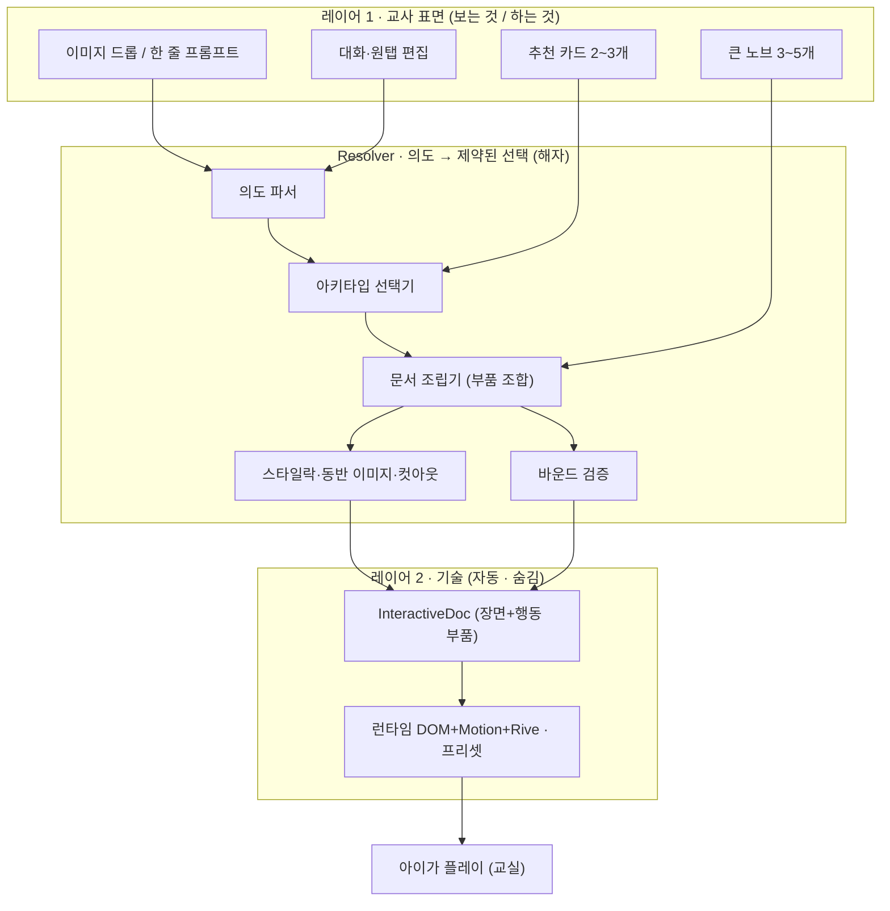

# 킨더버스 게임 뷰어 — 두 레이어 설계 (v2)

> 교사는 게임 제작자가 아니다. 우리는 퀄리티를 **제약으로 박제**해 두고, AI는 그 좋은 블록 공간 안에서 **고를** 뿐이다.
> 북극성: **① 설정 0으로 첫 플레이까지 걸린 시간(TTFP)** · **② 수정 없이 그대로 쓴 게임 비율(무수정 사용률)**.
> 건강 지표: **게임 수 ÷ 부품 수** — 이 비율이 커질수록 시스템이 일하고, 1에 가까우면 종속 경고.

---

## 0. 핵심 원칙 (이 문서 전체가 따르는 5줄)

1. **교사 ≠ 제작자.** 편집을 쉽게 만드는 게 아니라 제작 부담 자체를 없앤다.
2. **퀄리티는 박제, AI는 선택.** AI가 좋은 결과를 "만들길" 기대하지 않는다. AI가 고를 수 있는 선택지를 전부 미리 좋게 만들어 둔다. → 하한선 보장.
3. **고르기 >> 고치기.** 비제작자에겐 고르기는 쉽고 고치기는 어렵다. 모든 단계에서 빈 입력칸 대신 강한 후보를 제안하고 고르게 한다.
4. **교사 자료가 앵커.** 모두가 원탭 AI로 가면 결과가 평준화된다(슬롭). 교사 자신의 사진·교구를 앵커로 쓰면, 시스템은 제약돼 있어도 결과는 매번 그 교사만의 것이 된다 → 차별화.
5. **아이디어는 "게임"이 아니라 "부품"으로 들어온다.** 완성 게임을 통째로 넣으면 종속이고, 부품으로 분해해 넣으면 확장이다. 부품은 천천히 늘고 게임은 폭발적으로 는다.

---

## 1. 구조: 두 레이어 + 그 사이의 Resolver

교사는 **레이어 1(표면)만** 만진다. **레이어 2(기술)는 절대 노출되지 않는다.** 둘 사이를 잇는 **Resolver**가 "교사의 의도"를 "제약된 좋은 선택"으로 번역한다. 이 Resolver가 우리의 진짜 해자다.



**계약(Contract):** 교사는 InteractiveDoc를 직접 편집하지 않는다. 교사가 만지는 건 오직 **의도**(드롭·프롬프트·노브·발화)다. Resolver만이 의도를 InteractiveDoc로 변환한다. → 교사 입력이 아무리 막연해도 결과 문서는 항상 유효하고 예쁘다.

---

## 2. 레이어 1 — 교사 표면 (전부 구체적으로)

### 2.1 진입: 드롭 또는 한 줄
- **이미지/교구 드롭** — 보드 노드에서, 또는 파일에서 뷰어에 떨군다. (기본·권장 경로)
- **한 줄 프롬프트** — "텃밭에 심긴 채소 맞추기 만들어줘" 같은 자유 지시.

### 2.2 추천 카드 (강한 후보 2~3개)
드롭/프롬프트 직후, **이 소재에 맞춰진 게임 후보 2~3장**이 하단에 뜬다.
- 각 카드 = **교사 언어 장르명 + 그 소재로 만든 라이브 미니 프리뷰.** (기술 부품명 노출 금지.)
- 카드 탭 = 완성. 비제작자의 메인 경로. (빈 캔버스 금지.)

### 2.3 큰 노브 3~5개

| 노브 | 교사가 보는 선택지 | 의미 |
|---|---|---|
| **난이도** | 아기반 · 유아반 · 형님반 | 보기 수·헷갈림·힌트·아이템 수를 한 번에 |
| **분량** | 짧게 · 보통 · 길게 | 문제 수 (3 / 5 / 8) |
| **분위기** | 차분하게 · 신나게 · 깜짝깜짝 | 모션·보상·사운드·색감 강도 |
| **읽어주기** | 켜기/끄기 + 밝은/차분한 목소리 | 음성 내레이션(TTS) |
| **소재** | 드롭 이미지 + "비슷한 친구 자동 추가" 토글 | 콘텐츠 + 동반 이미지 생성 |

> 기본값으로도 바로 플레이된다. 노브는 "조정하고 싶으면" 쓰는 것이지 필수가 아니다.

### 2.4 편집: 대화 + 원탭 (속성 패널 금지)
- **자연어**: "이 동물 바꿔줘", "더 크게", "더 신나게", "배경 숲으로".
- **원탭/드래그**: 아이템 탭해서 교체, 새 이미지 떨궈서 교체.
- 정밀 편집(캔버스·핸들·속성 패널)은 **"고급" 뒤에 숨긴** 옵션. 99%의 교사는 안 본다.

### 2.5 모든 곳에서 "제안 → 고르기"
편집조차 빈칸을 열지 않는다. "이거 바꿔줘" → 대체 후보 2~3개를 만들어 보여주고 탭하게 한다.

---

## 3. 레이어 2 — 기술 (자동 핸들링, 교사 비노출)

- **InteractiveDoc** — 장면 그래프(Image/Text/Shape/Sticker/Group/Zone/Slot/Cover/Hidden/Cue) + 선언적 행동 레이어(부품). 게임 로직 = 코드가 아니라 데이터.
- **아키타입 + 부품 카탈로그** — §7 참조.
- **모션 프리셋 라이브러리** — entrance/idle/reaction/emphasis/exit/reward. 디자이너가 미리 튜닝(Motion 스프링 + Rive 트리거).
- **스타일락 + 동반 이미지 파이프라인** — 드롭 이미지에서 화풍 추출 → distractor·배경을 같은 룩으로 비동기 생성.
- **런타임** — 기본 DOM/CSS + Motion(요소 모션), Rive(반응형 캐릭터), canvas-confetti(보상). 이미지=`ImageProvider`(나노바나나), 음성=`TtsProvider`(CLOVA). 무거운 FX(Pixi)는 lazy-load.
- **보드 통합** — 게임 = 보드 아티팩트 노드. 공유 에셋 레이어(Supabase Storage 동일 객체 참조, 재업로드 0), zundo undo/redo 호환.
- **성능 규율** — transform·opacity만 애니메이트, 뷰포트 컬링·이미지 LOD, 동시 애니 캡, 약한 태블릿 기준 60fps. **비디오는 레인 뷰포트 밖이면 정지/언로드(§10.8).**

### 3.1 외부 의존 = 전부 "계약"으로 (교체 가능)

특정 모델/서비스를 박지 않고 인터페이스로 추상화하되, **현재 구현을 명시**한다. 구현체가 바뀌어도(나노바나나→타 모델, CLOVA→타 TTS 등) 게임 로직은 인터페이스만 의존한다.

**`CutoutProvider` (누끼/배경제거)**
- 인터페이스: `cutout(image) -> 투명 PNG (+ alpha mask)`
- **현재 구현**: 레포 공용 온디바이스 엔진 `@/shared/background-removal/removeBackground.ts` (RMBG/BiRefNet 계열, **MIT**), transformers.js + `worker.ts`, 서버 전송 0. 🔴 `@imgly`(AGPL) 금지 — 레포에서 의도적으로 제거됨.
- 백엔드: **WASM + q8(8비트 양자화) 단일 경로.** WebGPU는 storage buffer 17개 요구 vs 다수 기기 한계 16 → 실패. fp32/fp16은 OOM. q8만 안정, **약 9~13초**(저사양 더 김).
- 후처리: `cleanupBackground` — 모델 재실행 없는 순수 픽셀 연산(알파 임계·연결요소 제거·모폴로지 오프닝).
- **규칙(중요)**: 추론이 느려 **절대 크리티컬 패스에 두지 않는다.** 비동기 워커 큐 + **시드=원본으로 즉시 플레이** → 완료 시 투명 PNG로 조용히 스왑. **결과 캐싱(assetRef 기준)** → 동일 에셋 재추론 0.

**`ObjectSegmenter` (객체 지우기 — 별개 인터페이스)**
- 인터페이스: `segment(image, clickPoint) -> mask`
- **현재 구현**: `Xenova/slimsam-77-uniform`(SlimSAM, Apache-2.0), 클릭 객체 분할.
- **용도**: 편집기의 "AI 객체 지우기" 전용. **누끼(CutoutProvider)와 혼동 금지** — 별개 모델·별개 경로.

**`ImageProvider` (이미지 생성/소싱) — 퀄리티 엔진**
- 인터페이스: `generate(prompt, styleRef?) -> 이미지` · `editVariant(image, instruction) -> 이미지`
- **현재 구현**: **나노바나나(Gemini 이미지 생성).** 스타일락에 `styleRef`로 화풍 고정 → distractor·배경을 같은 룩으로 동반 생성(캐릭터/스타일 일관성 강점).
- **규칙**: **비동기 큐 + 저해상 플레이스홀더 → 고해상 스트리밍**(크리티컬 패스 금지). 생성 캐싱(스타일+주제 키). 동반 이미지 수는 `settings.companionCount`로 **비용 제어**(생성은 캐시가 덜 먹히는 비용 변수).
- 🔴 **`assetKind: "child-photo"`(아이 사진)는 절대 외부 API 미전송** — 누끼(온디바이스 RMBG)만 적용. (기존 안전 규칙 유지.)
- 🔴 **`assetKind: "child-video"`(아이가 찍힌 영상)도 외부 API 미전송** — child-photo와 동일.

**`TtsProvider` (나레이션) — 음성 우선 제품의 핵심**
- 인터페이스: `synthesize(text, voice) -> 오디오`
- **현재 구현**: **CLOVA Voice(NCP, 유료 종량제).** 밝고 다정한 **한 명의 보이스로 고정**(유아용).
- **규칙**: **문장 단위 캐싱**(같은 문장 재합성 0) → 미리 합성·저장 후 재생. 브라우저 `speechSynthesis`는 **폴백으로만**. `ttsLocale: "ko-KR"`.
- 비용: 종량제(글자당)지만 **유아 게임은 문장이 반복·한정적 → 캐시 적중률 극대 → 실질 비용 ≈ 0.** 단가/무료한도/아동 보이스는 NCP 콘솔에서 키 발급 시 확정.

---

## 4. Resolver — 의도를 제약된 선택으로 (경쟁력의 핵심)

1. **의도 파서** — 프롬프트/드롭 이미지/노브 → 구조화 의도{주제, 아키타입 후보, 난이도, 분위기, 분량, 소재}. (비전 분석 = 주제·스타일·개수.)
2. **아키타입 선택기** — 의도 → 랭킹된 아키타입 = **추천 카드.** "왜 이걸?"의 근거를 내부적으로 가짐.
3. **문서 조립기** — 선택된 아키타입 + 부품 조합 + 콘텐츠 + 노브 → InteractiveDoc. **good-block 공간에서 선택만**(프리셋·레이아웃·팔레트). 가능한 곳은 결정론적, AI는 진짜 모호한 매핑에만 개입.
4. **스타일락·컷아웃 오케스트레이션** — 동반 이미지 생성·파생(실루엣·복제·리컬러) + 누끼를 비동기 큐로. 시드 이미지로 즉시 플레이, 완료본은 스트리밍 교체.
5. **바운드 검증** — 못나거나 깨진 문서를 절대 내보내지 않는다.

> AI가 헛다리를 짚어도 **결과가 못나질 수 있는 영역이 아예 없다.** AI를 똑똑하게 만드는 게 아니라, 못 만들 수 없는 building block 세트를 만든다.

---

## 5. 매핑 표 — "작은 설정 → 복잡한 기술 자동"

| 교사 행동/노브 | 교사 언어 | Resolver가 자동 설정하는 기술 파라미터 |
|---|---|---|
| **난이도** | 아기반/유아반/형님반 | `optionCount`(2/3/4) · `distractorSimilarity` · `hintReveal` · `timer` · `itemCount` |
| **분량** | 짧게/보통/길게 | `roundCount`(3/5/8) |
| **분위기** | 차분/신나게/깜짝 | `motionPreset.intensity`(soft/lively/punchy) · `reward.intensity` · `sound` · `palette.warmth` · `idle.amplitude` |
| **읽어주기** | 켜기/끄기·목소리 | `tts.enabled` · `ttsLocale: ko-KR` · `voice.tone` · `narration.timing` |
| **소재** | 이미지 + 자동추가 토글 + 개수 | `contentSet` · `styleLock: on` · `companionCount` · `cutout: async` |
| 추천 카드 탭 | "이 게임으로" | `archetype` · `behaviorComponents[]` · `layout` |
| 이미지 드롭 | 떨구기 | 보드 공유 `assetRef` · `styleDescriptor` 추출 · 컷아웃 큐 등록 |

---

## 6. 편집 의도 → 동작 매핑 (대화/원탭)

| 교사 발화/행동 | 내부 연산 | 규칙 |
|---|---|---|
| (아이템 탭) "이거 바꿔줘" | 같은 셋에서 대체 후보 2~3 생성 → 탭 선택 | 빈칸 금지, 후보 제시 |
| "더 크게 / 작게" | 선택 노드 `transform.scale` 단계 이동 | 단계형 |
| "더 신나게 / 차분하게" | 전역 분위기 노브 한 단계 이동 | 노브 재사용 |
| "동물 2개 더" | `itemCount +2` + 동반 생성 | 스타일락 유지 |
| "배경 숲으로" | 배경 슬롯 교체 (후보 제시) | 후보 제시 |
| "짝맞추기로 바꿔줘" | 같은 콘텐츠로 `archetype` 교체 → 재조립 | 콘텐츠 보존 |

**불변 규칙:** 어떤 편집도 (a) 빈 입력 필드를 열지 않고 (b) 항상 후보를 제시해 고르게 하며 (c) 결과는 항상 유효·고퀄 범위 안.

---

## 7. 부품 카탈로그 (Component Catalog)

게임 = 장면 + **부품(선언적 행동) 조합**. 부품은 콘텐츠와 무관하게 직교(orthogonal)해야 한다 — 특정 소재("텃밭 전용")에 묶이면 그게 종속이다. 부품은 성격별로 세 그룹으로 갈린다.

### A. 선언적 부품 — 쉬움·안전·대부분 (새 엔진 0)
"탭/드래그 → 규칙 판정 → 연출"을 데이터로 표현. InteractiveDoc 행동 레이어에 그대로 등록.

| 부품 | 하는 일 | 필요한 노드 역할 | 런타임 |
|---|---|---|---|
| `reveal` | 가린 오브젝트를 정답/액션 시 공개 | `Cover`·`Hidden`·`Cue` | DOM 마스크 + Motion 스프링 + confetti |
| `partial-cue` | 대상의 일부(크롭/확대/실루엣)만 단서로 제시 | `Cue`(crop/region)·`Target` | 크롭/마스크 |
| `binary-choice` | OX / 둘 중 하나 | `Prompt`·option×2 | 탭 판정 |
| `match-pair` | 같은 것/짝 연결 | `LeftSet`·`RightSet`·`pairRule` | 드래그/탭 연결 |
| `connect` | 관계로 연결(A는 B와 관련) | `items`·`relationRule` | 드래그/탭 연결 |
| `flip-memory` | 뒤집기 + 위치 기억 | `cards`(face/back)·memory state | Motion flip(rotateY) + 상태 |
| `combine` | A+B→C 결합/변신 (수량 포함 가능) | `ingredients`·`recipe→result`·`count?` | Motion morph/scale + 변신 애니 |

> `count`(수세기)는 독립 아키타입이라기보다 `combine` 등에 얹히는 **모디파이어**로 둔다.

### B. 상태-반응 부품 — 퀄리티 도약 (우리만의 무기)
"내 선택이 캐릭터/장면의 상태를 바꾼다"는 피드백 루프. **Rive 상태머신**과 맞물린다. §9에서 심화.

| 부품 | 하는 일 | 필요한 노드 역할 | 런타임 |
|---|---|---|---|
| `responsive-state` | 선택이 캐릭터 상태(표정/행동)를 실제로 바꿈 | `actor`(Rive)·`stateMap`(choice→state) | **Rive state machine** |
| `goal-state` | 여러 액션 후 목표 상태 도달 시 클리어 | `goalCondition` | 상태 판정 + reveal/responsive 연계 |

### C. 실시간 아케이드 — 의도적으로 격리·후순위
실시간 물리·충돌·연속 입력. **선언적 데이터로 표현 불가**, 매 프레임 게임 루프 필요. 무겁고 "선언적 문서→자동 조립" 철학과 어긋남.

| 부품 | 하는 일 | 정책 |
|---|---|---|
| `realtime-arcade` | 피하기/잡기 등 실시간 미션 | **M0~M3 제외, 후순위.** 별도 아케이드 런타임으로 격리. 컷아웃·스타일락과 비연동 |

> **물리 처리 원칙**: 마차가 굴러가고 바람개비가 도는 류는 "진짜 물리"가 아니라 **Motion 스프링/회전으로 '물리처럼 보이는 연출'**로 충분(가볍고 예쁨). 실제 인과 시뮬레이션(돌린 만큼 전기가 차오름)만 C그룹으로 후순위.

---

## 8. 아이디어 → 부품 분해 (종속 방지 프로세스)

### 8.1 표준 절차
새 아이디어가 들어오면 넣기 전에 분해한다.
1. **이 게임은 어떤 부품들의 조합인가?**
2. **그 부품이 이미 있나, 새 부품인가?** → 있으면 부품 추가 0(그냥 됨), 새 부품이면 카탈로그에 추가.
3. **새 부품이 직교적인가?** → 특정 소재에 묶이면 거부, 콘텐츠 무관하게 일반화.

→ 부품은 천천히 늘고 게임은 폭발적으로 는다. **건강 지표 "게임 수 ÷ 부품 수"가 커지면 정상, 1에 가까우면 종속 경고.**

### 8.2 실전 예시 — 9개 아이디어 분해 (새 부품은 6개뿐)

| # | 아이디어 | 분해된 부품 | 새 부품? |
|---|---|---|---|
| 1 | 엉덩이·꼬리만 보이는 동물 맞추기 | `reveal` + `partial-cue` + 컷아웃 | 텃밭 뽑기와 **공유** ✅ |
| 2 | 특정 부위만 크게 보여주고 맞추기 | `partial-cue` + `tap-the-right-one` | 1번 **공유**, 크롭만 다름 ✅ |
| 3 | 카드 뒤집기 기억력 | `flip-memory` + `match-pair` | **새 1개**(`flip-memory`) |
| 4 | 피하거나 잡는 미션 | `realtime-arcade` | **새 1개(C·후순위)** |
| 5 | OX 퀴즈 | `binary-choice` | **새 1개**(최단순) |
| 6 | 감정 맞추고 반응→표정 변화 | `tap-the-right-one` + `responsive-state` + Rive | **새 1개**(`responsive-state`·무기) |
| 7 | 물건 결합→새 물건(호박+오렌지=마차) | `combine` + `count` + 변신 애니 | **새 1개**(`combine`) |
| 8 | 도구 모아 문제 해결(나무→사다리→구출) | `combine` + `goal-state` | 7번 **재사용** + 목표판정 ✅ |
| 9 | 유사 개념 연결(소방서=소방관) | `connect` | `match-pair` 친척, 거의 **재사용** ✅ |

**결론: 아이디어 9개 → 새 부품 6개(그중 1개는 후순위 C).** 부품 5~6개로 9개를 한참 넘는 게임이 나온다. 종속이 아니라 부품 라이브러리를 빠르게 채우는 **부트스트랩**.

---

## 9. `responsive-state` 심화 — 우리만의 무기 (Rive 상태머신)

대부분의 게임은 "정답/오답 피드백"에서 멈춘다. `responsive-state`는 **아이의 선택이 캐릭터를 실제로 변형시키는** 피드백 루프다. Canva류가 못 하는 차별화 지점.

### 9.1 메커니즘 (예: 감정 게임)
1. 친구 캐릭터가 슬픈 표정 (Rive state = `sad`).
2. "어떻게 도와줄까?" 선택지: 손수건 / 안아주기 / 모른 척.
3. 정답(손수건/안아주기) 탭 → Rive 상태머신 **input 발사** → state가 `comforted` → `happy`로 전이 → **표정이 실제로 부드럽게 바뀜.**
4. "고마워!" TTS + 보상 연출.

### 9.2 왜 Rive인가
- 상태머신 + inputs(트리거/불리언/숫자)가 네이티브. 전이 애니는 디자이너가 미리 작성 → 항상 매끄럽고 고퀄.
- 런타임이 작고 GPU(canvas/WebGL). 약한 태블릿에서도 가벼움.
- InteractiveDoc의 `responsive-state` 행동이 **선택 → Rive input을 선언적으로 매핑**. 런타임은 input만 먹이고, 애니는 Rive가 책임.

### 9.3 계약 (행동 스펙)
```
responsive-state {
  actorRef: "<file>.riv",
  stateMachine: "<name>",
  inputs: { [choiceId]: { name, value } },   // 선택 → Rive input
  goalState?: "<target state>"               // 도달 시 클리어
}
```

### 9.4 범용 레이어로서의 가치
감정 게임 전용이 아니다. **어떤 게임에든 "반응하는 마스코트"를 얹는 범용 부품**이 된다(정답 시 환호, 막힐 때 격려). 게임 전반의 체감 퀄리티를 끌어올리는 공통 장치.

### 9.5 비용·마일스톤
- Rive 저작은 에디터 무료, **상용 export는 Cadet 약 $9/월**(런타임은 추가 요금 없음, 오픈소스). 저렴.
- 저작 부담이 있으므로 **M2~M3**(기본 선언적 부품 A가 M0에 자리 잡은 뒤). 모든 요소를 Rive로 만들지 말 것 — 캐릭터/반응에만.

---

## 10. 확장활동(ExtendActivity) — 게임 = 도입, 확장 = 본체 (진짜 해자)

게임은 아이를 몰입시키는 **도입(hook)**일 뿐이다. 그 뒤의 **확장활동 — 토론·이야기·창작·연결·표현 — 이 교육적 본체**이고, 누리과정 연계가 여기서 일어난다. 게임은 평준화돼도 "놀이를 배움으로 잇는 힘"은 교육 전문성이라 카피되지 않는다.

### 10.1 재정의: play + extend 는 "하나의 가로 레인" 위에 있다
하나의 **활동(activity)** 문서가 두 구간을 가진다 — 단, **페이지로 분리되지 않는다.**
- **play** — 게임(`interaction` + `effects`). 레인의 **왼쪽** 구간.
- **extend** — `extend: ExtendActivity[]`. 게임 클리어 후 이어지는 교사 진행 활동. 레인의 **오른쪽**으로 계속 펼쳐짐. 채점 아님.

🔴 **킨더버스 정체성 = 무한 보드.** 게임과 확장은 **하나의 가로로 긴 캔버스(lane) 위에 좌→우로 나란히** 놓이고, 보이는 화면은 그 위를 비추는 **뷰포트(카메라)**일 뿐이다. 게임이 끝나도 **아무것도 사라지지 않는다** — 카메라가 오른쪽으로 팬할 뿐. 이는 보드의 **Workflow Lane**(한 요청이 가로로 확장되는 연결 노드들)과 같은 문법으로, 게임 뷰어를 보드와 한 세계로 묶는다.

> 앞서 임시로 둔 `discussion-prompt` 효과는 폐기 → `ExtendActivity`로 격상·흡수. 확장은 효과의 부속이 아니라 **1급 시민.**

### 10.2 확장 유형 5종 (아이디어들이 공통으로 가리킨 것)
| 유형 | 하는 일 | 예 |
|---|---|---|
| `discuss` | 열린 질문으로 사고·표현 유도 | "왜 그렇게 생각했어?" · "어디 살까?" |
| `story` | 게임 결과로 이야기 만들기 | "찾은 3개로 이야기를 만들어볼까?" |
| `name-create` | 명명·창작 | "이 음식 이름을 지어줄까?" · "이 색으로 뭘 그릴까?" |
| `connect-apply` | 생활·개념에 연결·적용 | "이 날씨엔 어떤 옷?" · "비 오는 날 무지개가 생기려면?" |
| `move-express` | 몸·표현으로 옮기기 | "개구리처럼 점프해볼까?" |

### 10.3 이번 단계 범위 = 교사 진행형 (가벼움)
- 화면은 **교사용 진행 카드**(질문·지시)를 띄우고 **음성(`TtsProvider`)으로 읽어준다.** 실제 토론·답은 교실에서 오프라인.
- **아이 응답 수집(그리기/녹음/선택)은 후속 옵션** — 무겁고 아동 데이터 프라이버시가 얽혀서 지금은 안 한다. (확장의 핵심 가치는 "좋은 질문을 던지는 것"만으로 대부분 나온다.)

### 10.4 누리과정 태깅 — 카피 불가능한 자산
각 확장활동에 누리과정 영역 태그(`communication·nature-inquiry·social·art·physical`). 쌓이면 "이 활동이 어떤 발달영역을 다루나"가 자동 정리 → 교사 신뢰 + 검색·추천 근거. **경쟁사가 게임은 베껴도 이 교육 메타데이터는 못 베낀다.**

### 10.5 계약 스케치 (스키마 반영용)
```
ExtendActivity {
  type: "discuss" | "story" | "name-create" | "connect-apply" | "move-express",
  prompts: string[],          // 교사 진행 질문/지시 (아이 눈높이, TTS로도 읽힘)
  tts?: boolean,              // 음성 읽어주기 (기본 true)
  nuri?: NuriArea[],          // 누리과정 영역 태그
  // DEFERRED: response?: "none" | "draw" | "voice" | "choice"  ← 아이 응답 수집(후속)
}
InteractiveDoc.extend: ExtendActivity[]   // 0..N, play '오른쪽' 같은 stage 레인 위 (별도 페이지 아님)
```

### 10.6 런타임: 단일 가로 레인 + 카메라 팬 (페이지 전환 금지)
🔴 게임↔확장은 **절대 페이지 전환·언마운트하지 않는다.** `display:none`·route 교체 금지.
- **단일 레인**: play 구간(좌)과 extend 활동들(우)이 하나의 넓은 stage 캔버스 위 좌→우로 배치. 확장이 여러 개면 **계속 오른쪽으로 한 줄**(게임 → 확장1 → 확장2 …) — Workflow Lane과 동일.
- **전환 = 카메라 팬**: 게임 클리어 → 카메라(뷰포트)가 오른쪽 다음 구간으로 **부드러운 스프링 팬.** 게임 결과물(뽑은 당근·맞춘 동물)은 왼쪽에 **그대로 상주.**
- **결과물이 소재로**: 왼쪽 게임 결과가 오른쪽 확장의 시각적 소재가 된다("이거 봐, 우리가 뽑은 당근으로…"). 한 화면 흐름 안에 "가리킬 대상"이 살아있다.
- **진행**: 교사가 다음으로 넘기면 카메라가 한 칸 더 오른쪽으로. 아이는 "여기까지 왔다"를 가로로 한눈에 본다. 뒤로 팬해 게임을 다시 볼 수도 있다.
- **성능**: 가로 레인이라 **뷰포트 밖 구간은 컬링**(특히 비디오는 정지/언로드 — §10.8).

### 10.7 Resolver: 게임 + 확장을 함께 생성
교사가 "텃밭 채소 맞추기" 한 줄 → 시스템이 게임 + **그에 맞는 확장활동(예: `name-create` "이 채소로 무슨 요리를 할까?")까지** 제안. 교사는 게임이 아니라 **완결된 활동 흐름**을 받는다. 이게 "교사 ≠ 제작자"의 완성형.


### 10.8 동영상(video) 지원
비디오는 stage **전역 노드 타입** — play·extend 어디서나(레인 좌우 모두) 놓인다. 예: 도입 상황 영상, 확장의 "당근 자라는 타임랩스", 캐릭터 시연.
- **노드/콘텐츠**: 장면에 `video` 노드 추가, 보기·큐가 영상이면 `ContentBinding`에 `video` 추가. (스키마: §10.9)
- **성능**: 레인 뷰포트에 보일 때만 재생, 벗어나면 정지/언로드. 포스터(썸네일) 먼저 → 탭/진입 시 재생.
- **음성 우선 충돌 방지**: 기본 **음소거 + 자동재생 루프**(짧은 시연). 소리 있는 영상은 **탭하면 재생**, 재생 중엔 **TTS 나레이션이 양보.**
- 🔴 **아이 안전**: 외부 임의 영상(YouTube 등) **자동 임베드 금지.** 교사 업로드(Supabase Storage) + 우리 큐레이션 라이브러리만. 길이는 짧게(유아 집중).
- 🔴 **`assetKind: "child-video"`(아이가 찍힌 영상)는 외부 API 미전송** — child-photo와 동일 규칙.

### 10.9 계약 스케치 (레인 + 비디오, 스키마 반영용)
```
// 장면 노드 추가
VideoNode { type:"video", asset:AssetRef, poster?:string, autoplay?:boolean,
            loop?:boolean, muted?:boolean(기본 true), controls?:"none"|"tap" }
// 콘텐츠 바인딩 추가
{ type:"video", asset: AssetRef }
// AssetKind 추가
"child-video"   // 외부 미전송
// 레인: extend 활동은 play 오른쪽 stage 좌표에 배치(별도 페이지 아님). 클리어 시 카메라가 팬.
```

## 11. 가드레일 — 철학을 배신하지 않게 하는 장치

- ❌ 기본 경로에 **속성 패널/커브 에디터/색상 피커 금지** (→ "고급" 뒤로).
- ✅ **선택 > 편집**: 모든 분기는 후보 제안.
- ✅ **콘텐츠 앵커**: 교사 자료를 우선 소재로.
- ✅ **바운드 생성**: AI는 good-block에서 고를 뿐, 임의 HTML/CSS 발명 금지.
- ✅ **부품 직교성**: 새 부품은 특정 소재에 묶이지 않게 일반화.
- ✅ **컷아웃은 크리티컬 패스 금지**: 시드=원본 즉시 플레이 → 완료 시 스왑. 연출이 추론을 기다리지 않는다.
- ✅ **물리는 연출로**: Motion 가짜 물리 우선, 실제 시뮬레이션(C그룹)은 격리·후순위.
- ✅ **속도 우선**: 비동기 큐 + 저해상 플레이스홀더 → 고해상 스트리밍.

---

## 12. 지표 (성공의 정의)

**주 지표**
1. **TTFP (Time-To-First-Play)** — 드롭/프롬프트 → 첫 플레이까지 초 (설정 0 기준).
2. **무수정 사용률** — 생성 결과를 수정 없이 교실에 쓴 비율.

**건강 지표**
3. **게임 수 ÷ 부품 수** — 커질수록 시스템이 일하는 것. 1에 가까우면 종속 경고.

**보조 지표**
- 추천 카드 1탭 채택률 / 후보 제시 대비 선택 전환율.
- 평균 편집 횟수(↓) · 고급 에디터 진입률(낮게 유지).
- 재사용·리믹스율.
- **확장활동 도달률**(게임 클리어 → 확장 진입 비율) · **확장 완료율**(확장 카드 끝까지 진행).

> 교사가 AI 결과를 계속 손봐야 한다면, AI가 아무리 똑똑해도 이 철학은 **실패하고 있는 것.**

---

## 13. End-to-End 워크스루

### 13.1 채소 맞추기 (`tap-the-right-one` + 추천 플로우)
박교사, 햇살반. 텃밭 활동 사진(토마토·상추·당근)을 뷰어에 드롭.
1. **(~0.5초)** 비전 분석: "채소 3종·실사". 프롬프트 박스 + 추천 카드 3장: "무엇일까 맞추기 / 같은 채소 짝맞추기 / 몇 개일까 세기", 각 카드에 그 사진으로 만든 라이브 프리뷰.
2. "무엇일까 맞추기" 탭 → 즉시 시드(3장)로 플레이. distractor·배경은 같은 실사 화풍으로 비동기 생성(저해상→고해상 스트리밍).
3. 노브: 난이도 "유아반"(기본), 분위기 "신나게"로 한 번 변경, 읽어주기 켜짐. 끝.
4. 보드 햇살반 Workflow Lane에 아티팩트 노드로 저장. 다음 주 리믹스.

**제작 행위 = 0.** 노브 1개 + 음성 토글뿐.

### 13.2 텃밭 뽑기 (`reveal-and-collect` = `tap-the-right-one` + `reveal`, 컷아웃 타이밍 포함)
교사: "텃밭에 심긴 채소 맞추기 — 맞히면 흙에서 쑥 뽑히게." → 당근 사진 한 장 드롭.
Resolver가 `reveal-and-collect`를 추천 카드로 제시, 탭 시 자동 조립.

| 단계 | 컷아웃 상태 | 연출 |
|---|---|---|
| 드롭 직후 | 원본(누끼 전) | 흙 `Cover` 뒤에 원본 작물, 잎사귀(`Cue`)만 노출 → **바로 플레이 가능** |
| 워커 추론 중(~10초) | 진행 중 | 백그라운드, 아이는 단서 보고 추측 (대기 안 느낌) |
| 컷아웃 완료 | 투명 PNG | 작물 피사체 **조용히 스왑** → 뽑힐 때 흙만 깔끔히 |
| 정답 탭 | 완료본 사용 | `Hidden` 작물이 마스크 아래→위 스프링(살짝 오버슈트) + 갈색 흙먼지(confetti) + "당근이에요!" TTS |

> 정답 탭 시점에 컷아웃이 아직이면 → 원본으로 일단 뽑고, 끝나는 즉시 교체. **연출이 추론을 기다리지 않는다.**

이 게임의 정체 = `tap-the-right-one`(맞추기) + `reveal`(공개) + 컷아웃. 같은 부품으로 "조개 속 진주", "상자 속 선물", "안개 걷히면 동물"이 전부 자동 생성된다.

---

## 14. M0 범위 매핑 (이 철학이 어디서 구현되나)

| 마일스톤 | 역할 | 부품 |
|---|---|---|
| **M0** | InteractiveDoc + 런타임 + 계약(레이어 분리) + 바운드 검증 토대 | 선언적 A 중 `tap-the-right-one`·`match-pair` |
| **M1** | 직접 에디터(단, "고급" 뒤로). 대화/원탭 편집이 기본 경로 | A 확장: `reveal`·`partial-cue`·`binary-choice`·`flip-memory`·`connect` |
| **M2** | 의도 파서 + 추천 카드 + Resolver. "고르기 > 고치기" 작동 지점 | `combine`·`goal-state`, `responsive-state` 착수 |
| **M3** | 스타일락 동반 생성 + 컷아웃 파이프라인 안정화. 퀄리티 박제 | `responsive-state` 완성(Rive) |
| **M4** | 아키타입 확장 + 폴리시 + 피드백 루프(복리 해자) | (검토) `realtime-arcade` 격리 도입 여부 |

---

### 한 줄 결론
관점은 옳다. "AI가 퀄리티를 만든다"를 **"우리가 퀄리티를 박제하고 AI는 의도에 맞게 고른다"**로, 그리고 "아이디어 = 게임"을 **"아이디어 = 재사용 부품"**으로 바꾸면 실제로 작동한다. 교사 표면은 작고 직관적으로, 그 아래 기술은 자동으로, 둘 사이 Resolver가 우리의 해자가 된다.
